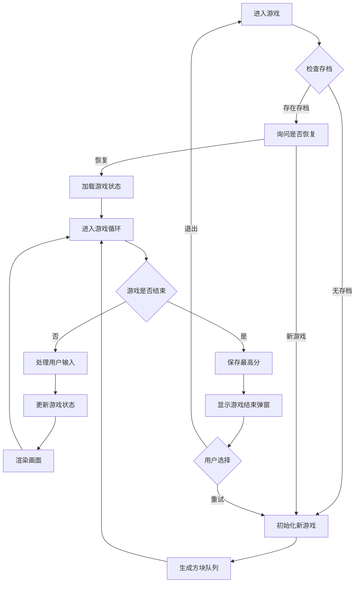

## 1. 产品概述

本项目是一个基于 HTML、CSS 和原生 JavaScript 的经典俄罗斯方块游戏。游戏采用 10x20 网格布局，支持七种经典方块随机下落，提供丰富的游戏功能和用户体验优化，支持桌面端和移动端跨平台游玩。

- 面向所有年龄段用户的休闲益智游戏
- 目标是打造功能完整、体验流畅、视觉美观的俄罗斯方块游戏

## 2. 核心功能

### 2.1 功能模块

1. **游戏主界面**: 游戏画布、分数显示、等级显示、消除行数统计
2. **游戏控制**: 键盘操作、触摸操作、虚拟按钮
3. **预览系统**: 下一个方块队列（3个）、落点阴影预览
4. **分数系统**: 分数计算、最高分存储、等级提升
5. **音效系统**: 移动、旋转、消除、游戏结束音效
6. **主题系统**: 暗色/亮色主题切换
7. **存档系统**: 游戏状态保存与恢复

### 2.2 页面详情

| 页面名称 | 模块名称 | 功能描述 |
|---------|---------|---------|
| 游戏主页面 | 游戏画布 | 10x20网格，方块渲染、碰撞检测、行消除动画 |
| 游戏主页面 | 信息面板 | 当前分数、最高分、等级、消除行数显示 |
| 游戏主页面 | 预览区域 | 下一个3个方块预览队列 |
| 游戏主页面 | 控制区域 | 开始/暂停、重新开始、音效开关、主题切换按钮 |
| 游戏主页面 | 触摸控制 | 移动端虚拟方向键和操作按钮 |
| 游戏结束弹窗 | 结束界面 | 显示最终得分、重试按钮 |

## 3. 核心流程

## 4. 用户界面设计

### 4.1 设计风格

- **主题**: 采用现代简约风格，支持暗色/亮色双主题
- **主色调**: 暗色主题 - 深灰背景 + 霓虹方块配色；亮色主题 - 浅灰背景 + 饱和方块配色
- **字体**: 使用等宽字体增强游戏感，数字显示清晰易读
- **按钮**: 圆角设计，悬停有动效，点击有反馈
- **动画**: 方块消除闪烁动画、下落平滑过渡、主题切换过渡

### 4.2 页面设计概述

| 页面名称 | 模块名称 | UI 元素 |
|---------|---------|---------|
| 游戏主页面 | 游戏画布 | 居中10x20网格，网格线淡化显示，方块有立体感 |
| 游戏主页面 | 信息面板 | 右侧信息区，分数大号字体，等级徽章样式 |
| 游戏主页面 | 预览区域 | 3个小画布垂直排列，显示下一个方块 |
| 游戏主页面 | 控制区域 | 顶部/底部工具栏，图标按钮 |
| 游戏主页面 | 触摸控制 | 底部虚拟方向键，半透明背景 |
| 游戏结束弹窗 | 结束界面 | 半透明遮罩，居中卡片，按钮动效 |

### 4.3 响应式设计

- 桌面端: 左右布局，左侧游戏区，右侧信息面板
- 平板端: 上下布局，游戏区居中，信息面板在下方
- 移动端: 垂直布局，游戏画布自适应，底部虚拟控制按钮
- 触摸优化: 按钮最小尺寸 44x44px，支持滑动手势

