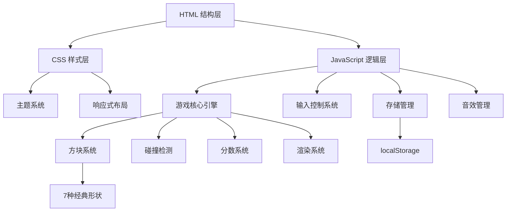

## 1. 架构设计



## 2. 技术描述

- **前端**: 纯 HTML5 + CSS3 + 原生 JavaScript (ES6+)
- **渲染**: HTML5 Canvas API 绘制游戏画面
- **存储**: localStorage 存储最高分、游戏状态、主题设置
- **音效**: Web Audio API 生成合成音效（无需音频文件）
- **无外部依赖**: 所有功能原生实现，零第三方库

## 3. 文件结构

| 文件 | 目的 |
|------|------|
| index.html | 游戏主页面，包含 Canvas 和 UI 元素 |
| css/style.css | 样式文件，包含主题变量和响应式布局 |
| js/tetris.js | 游戏核心逻辑和渲染引擎 |

## 4. 核心数据结构

### 4.1 方块定义

```javascript
// 7种经典俄罗斯方块形状
const SHAPES = {
  I: [[1,1,1,1]],
  O: [[1,1],[1,1]],
  T: [[0,1,0],[1,1,1]],
  S: [[0,1,1],[1,1,0]],
  Z: [[1,1,0],[0,1,1]],
  J: [[1,0,0],[1,1,1]],
  L: [[0,0,1],[1,1,1]]
};

// 方块颜色配置
const COLORS = {
  I: '#00f0f0', O: '#f0f000', T: '#a000f0',
  S: '#00f000', Z: '#f00000', J: '#0000f0', L: '#f0a000'
};
```

### 4.2 游戏状态

```javascript
const gameState = {
  board: [],           // 10x20 游戏面板
  currentPiece: null,  // 当前方块
  nextQueue: [],       // 下一个方块队列（3个）
  score: 0,            // 当前分数
  highScore: 0,        // 最高分
  level: 1,            // 当前等级
  lines: 0,            // 消除总行数
  isPaused: false,     // 是否暂停
  isGameOver: false,   // 是否结束
  soundEnabled: true,  // 音效开关
  theme: 'dark'        // 主题：dark/light
};
```

## 5. 核心功能实现

### 5.1 游戏循环
- 使用 `requestAnimationFrame` 实现平滑渲染
- 基于等级的下落速度计算：`dropInterval = 1000 - (level - 1) * 80`
- 固定时间步长处理方块下落

### 5.2 碰撞检测
- 边界检测：方块不能超出面板左右和底部
- 方块检测：不能与已固定的方块重叠

### 5.3 行消除与计分
- 检测完整行并消除
- 计分规则：1行=100分，2行=300分，3行=500分，4行=800分，乘以等级系数

### 5.4 输入控制
- 键盘：← → 移动，↑ 旋转，↓ 加速下落，空格 硬到底，P 暂停
- 触摸：虚拟按钮 + 滑动手势支持

### 5.5 音效系统
- 使用 Web Audio API 的 OscillatorNode 生成不同频率的音效
- 移动、旋转、消除、游戏结束各有独特音效

### 5.6 存档系统
- 游戏状态自动保存到 localStorage
- 页面刷新时检测并提示恢复游戏

## 6. 性能优化

- Canvas 局部重绘而非全屏重绘
- 离屏 Canvas 预渲染方块
- 事件节流处理快速输入
- requestAnimationFrame 帧率控制

