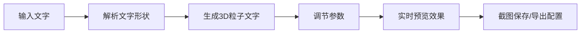

## 1. 产品概述

基于Three.js的3D粒子文字可视化工具，用户输入文字后生成由数千个彩色粒子组成的立体文字效果，支持多种自定义参数调节和动画效果。

- **主要用途**: 创建炫酷的3D粒子文字动画，可用于演示、艺术创作、社交媒体内容等场景
- **目标用户**: 设计师、创意工作者、开发者、普通用户
- **产品价值**: 提供零代码的3D粒子文字生成工具，让每个人都能轻松创建专业级的3D文字效果

## 2. 核心功能

### 2.1 功能模块

1. **主页面**: 3D场景展示区、控制面板、粒子统计信息

### 2.2 页面详情

| 页面名称 | 模块名称 | 功能描述 |
|---------|---------|---------|
| 主页面 | 文字输入区 | 输入框，最多10个字符，实时生成粒子文字 |
| 主页面 | 3D场景区 | Three.js渲染的粒子文字场景，支持鼠标拖拽旋转视角 |
| 主页面 | 粒子形状控制 | 切换球体、立方体、四面体三种粒子形状 |
| 主页面 | 粒子大小控制 | 滑块调节粒子整体大小 |
| 主页面 | 文字厚度控制 | 滑块控制立体文字的厚度层数 |
| 主页面 | 字体切换 | 默认字体和粗体字体两种选项 |
| 主页面 | 颜色渐变 | 文字从顶部到底部的颜色渐变效果 |
| 主页面 | 背景切换 | 黑色、星空、白色三种背景选项 |
| 主页面 | 拖尾效果 | 粒子旋转时的运动拖尾效果开关 |
| 主页面 | 散落动画 | 点击按钮后粒子散落再重新组合的动画 |
| 主页面 | 截图功能 | 一键保存当前效果为PNG图片 |
| 主页面 | 配置导入导出 | 导出JSON配置文件，从JSON导入恢复配置 |
| 主页面 | 粒子统计 | 实时显示当前粒子总数 |

## 3. 核心流程

用户在输入框输入文字 → 系统解析文字形状 → 生成数千个粒子组成立体文字 → 用户调节各项参数 → 预览实时效果 → 截图保存或导出配置

## 4. 用户界面设计

### 4.1 设计风格

- **设计主题**: 科技感、未来感、沉浸式
- **主色调**: 深色背景配合霓虹色彩的粒子
- **辅助色**: 蓝色、紫色、粉色渐变
- **控制面板**: 半透明毛玻璃效果，圆角设计
- **字体**: 现代无衬线字体，标题加粗
- **按钮风格**: 渐变背景，悬停有发光效果

### 4.2 页面设计概述

| 页面名称 | 模块名称 | UI 元素 |
|---------|---------|---------|
| 主页面 | 3D场景区 | 全屏Three.js画布，支持鼠标交互 |
| 主页面 | 控制面板 | 右上角固定面板，包含所有控制选项，采用折叠分组设计 |
| 主页面 | 粒子统计 | 左下角显示，简洁的数字展示 |

### 4.3 响应式设计

- 桌面端优先设计
- 移动端控制面板改为底部抽屉式布局
- 触摸设备支持手势旋转和缩放

### 4.4 3D场景设计

- **环境**: 黑色/星空/白色背景，粒子自发光效果
- **光照**: 环境光 + 点光源，突出粒子的立体感
- **相机**: 透视相机，支持OrbitControls控制
- **动画**: 文字自动绕Y轴旋转，散落和重组的过渡动画
- **后处理**: 辉光效果增强粒子的发光感
