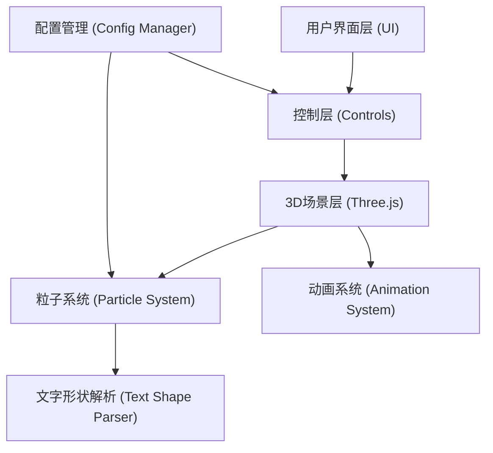

## 1. 架构设计



## 2. 技术描述

- **前端框架**: React@18 + TypeScript
- **构建工具**: Vite
- **样式方案**: TailwindCSS@3
- **3D引擎**: Three.js
- **字体加载**: Three.js FontLoader
- **文字解析**: Three.js TextGeometry

## 3. 核心技术点

### 3.1 粒子文字生成
- 使用Three.js的FontLoader加载字体
- 使用TextGeometry解析文字形状
- 从几何体中提取顶点位置作为粒子目标位置
- 根据厚度参数多层复制粒子，形成立体效果

### 3.2 粒子系统
- 使用InstancedMesh优化性能，支持数千粒子
- 粒子形状: 球体(SphereGeometry)、立方体(BoxGeometry)、四面体(TetrahedronGeometry)
- 每个粒子独立的颜色和大小属性

### 3.3 动画效果
- 自动旋转: 使用requestAnimationFrame更新rotation.y
- 散落动画: 使用GSAP或自定义缓动函数，粒子随机散开后回归
- 拖尾效果: 记录粒子历史位置，使用线条或渐变透明度实现

### 3.4 背景效果
- 黑色: 纯色背景
- 星空: Points生成随机分布的星星粒子
- 白色: 纯色背景

## 4. 组件结构

```
src/
├── App.tsx              # 主应用组件
├── main.tsx             # 入口文件
├── components/
│   ├── Scene.tsx        # 3D场景组件
│   ├── ControlPanel.tsx # 控制面板
│   └── ParticleStats.tsx # 粒子统计显示
├── hooks/
│   └── useParticleText.ts # 粒子文字核心逻辑
├── utils/
│   ├── textParser.ts    # 文字形状解析
│   ├── animation.ts     # 动画工具函数
│   └── export.ts        # 导出工具函数
├── types/
│   └── index.ts         # 类型定义
└── styles/
    └── index.css        # 全局样式
```

## 5. 配置数据结构

```typescript
interface ParticleConfig {
  text: string;
  particleSize: number;
  particleShape: 'sphere' | 'cube' | 'tetrahedron';
  thickness: number;
  fontWeight: 'normal' | 'bold';
  colorGradient: {
    top: string;
    bottom: string;
  };
  background: 'black' | 'stars' | 'white';
  trailEffect: boolean;
  autoRotate: boolean;
}
```

## 6. 性能优化

- 使用InstancedMesh渲染大量粒子
- 合理控制粒子数量（建议2000-5000）
- 动画使用requestAnimationFrame并节流
- 文字变化时复用几何体和材质，避免重复创建
