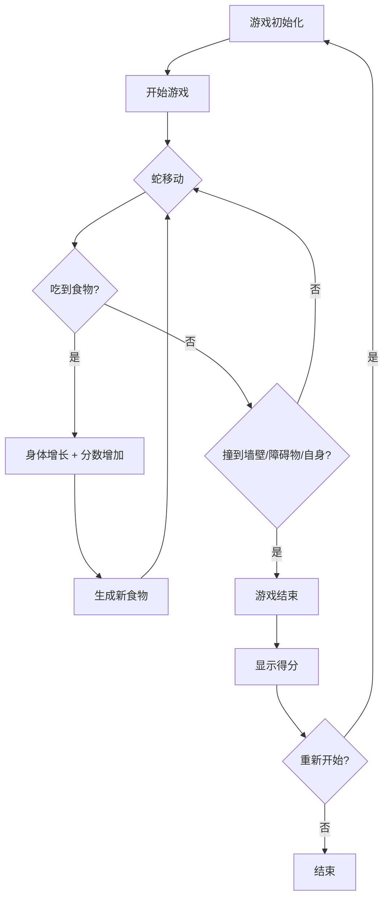

## 1. 产品概述

贪吃蛇游戏是一款经典的休闲益智游戏，玩家通过控制蛇的移动方向来吃掉食物并增长身体，同时避免撞到墙壁、障碍物或自身身体。

- 主要用途：提供休闲娱乐，锻炼反应能力和策略思维
- 目标用户：全年龄段游戏爱好者，支持PC端和移动端
- 产品价值：经典游戏复刻，增加丰富的自定义选项和游戏模式

## 2. 核心功能

### 2.1 用户角色

| 角色 | 注册方式 | 核心权限 |
|------|----------|----------|
| 普通玩家 | 无需注册 | 进行游戏、调整设置、查看分数 |

### 2.2 功能模块

1. **游戏主界面**：游戏画布、分数显示、控制按钮
2. **游戏设置面板**：速度选择、模式开关、主题切换
3. **游戏结束界面**：得分展示、重新开始按钮

### 2.3 页面详情

| 页面名称 | 模块名称 | 功能描述 |
|---------|---------|----------|
| 主界面 | 游戏画布 | 20x20网格，蛇、食物、障碍物渲染 |
| 主界面 | 分数面板 | 显示当前分数、历史最高分（localStorage存储） |
| 主界面 | 控制按钮 | 开始/暂停、重置、网格线开关 |
| 主界面 | 设置面板 | 速度选择（慢/中/快）、障碍物模式、穿墙模式、主题切换 |
| 结束界面 | 结果展示 | 显示最终得分、重新开始按钮 |

## 3. 核心流程

## 4. 用户界面设计

### 4.1 设计风格

- **主色调**：
  - 暗色主题：深灰背景(#1a1a2e)、绿色蛇身(#00ff88)、红色食物(#ff4757)、金色食物(#ffd700)
  - 亮色主题：浅灰背景(#f5f5f5)、绿色蛇身(#2ed573)、红色食物(#ff6b6b)、金色食物(#f9ca24)

- **按钮样式**：圆角矩形，悬停时有缩放和阴影效果，点击有按压反馈
- **字体**：使用现代无衬线字体，标题使用等宽游戏字体增强复古感
- **布局风格**：居中游戏画布，侧边控制面板，简洁现代
- **视觉效果**：蛇身颜色渐变（头部到尾部逐渐变浅），食物有脉冲动画效果

### 4.2 页面设计概述

| 页面名称 | 模块名称 | UI元素 |
|---------|---------|--------|
| 主界面 | 游戏画布 | 20x20网格、蛇（渐变颜色）、普通食物（红色）、金色食物（金色闪烁）、障碍物（灰色） |
| 主界面 | 分数面板 | 当前分数、最高分、速度指示器 |
| 主界面 | 控制面板 | 暂停/恢复按钮、重置按钮、网格线开关 |
| 主界面 | 设置面板 | 速度选择（单选按钮组）、障碍物模式开关、穿墙模式开关、主题切换开关 |
| 结束界面 | 弹窗 | 半透明遮罩、最终得分展示、重新开始按钮 |

### 4.3 响应式设计

- **桌面端优先**：完整布局，键盘方向键控制
- **移动端适配**：
  - 响应式画布缩放
  - 触摸滑动控制方向
  - 优化按钮大小便于触摸
  - 竖屏/横屏适配

### 4.4 交互细节

- 键盘方向键控制蛇移动
- 空格键暂停/恢复
- R键重置游戏
- 触摸滑动（上/下/左/右）控制方向
- 食物生成有小概率（10%）出现金色食物（50分）
- 游戏速度：慢速(200ms)、中速(120ms)、快速(70ms)
