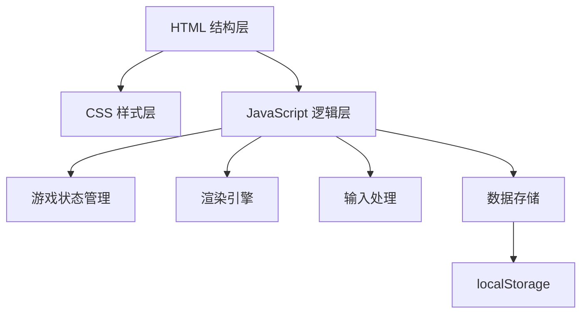

## 1. 架构设计



## 2. 技术描述

- **前端技术栈**：
  - HTML5：Canvas元素用于游戏渲染
  - CSS3：自定义属性(CSS Variables)实现主题切换、动画效果、响应式布局
  - 原生JavaScript：ES6+语法，无额外框架依赖

- **初始化方式**：直接创建HTML文件，无需构建工具

## 3. 文件结构

| 文件 | 用途 |
|------|------|
| index.html | 主页面结构，包含Canvas、控制面板、设置面板 |
| style.css | 样式定义，包含主题变量、布局、动画效果 |
| game.js | 游戏核心逻辑，包含状态管理、渲染、输入处理 |

## 4. 核心数据结构

### 4.1 游戏状态

```javascript
const GameState = {
  isPlaying: boolean,
  isPaused: boolean,
  score: number,
  highScore: number,
  speed: 'slow' | 'medium' | 'fast',
  obstacleMode: boolean,
  wallMode: 'solid' | 'wrap',
  gridVisible: boolean,
  theme: 'dark' | 'light'
}
```

### 4.2 游戏对象

```javascript
// 蛇
const snake = {
  body: [{x, y}],  // 坐标数组，第一个元素为蛇头
  direction: 'up' | 'down' | 'left' | 'right',
  nextDirection: 'up' | 'down' | 'left' | 'right'
}

// 食物
const food = {
  x: number,
  y: number,
  isGold: boolean
}

// 障碍物
const obstacles = [{x, y}]
```

## 5. 核心算法

### 5.1 碰撞检测

- **墙壁碰撞**：检测蛇头坐标是否超出边界（穿墙模式下循环到对侧）
- **自身碰撞**：检测蛇头坐标是否与身体任意节重合
- **食物碰撞**：检测蛇头坐标是否与食物坐标重合
- **障碍物碰撞**：检测蛇头坐标是否与任意障碍物重合

### 5.2 食物生成

1. 遍历所有空白网格（非蛇身、非障碍物）
2. 随机选择一个空白位置
3. 10%概率生成金色食物，90%概率生成普通食物

### 5.3 蛇移动逻辑

1. 根据当前方向计算新蛇头位置
2. 穿墙模式下处理边界循环
3. 将新蛇头添加到身体数组头部
4. 如未吃到食物，移除尾部一节

### 5.4 颜色渐变

```javascript
// 蛇身颜色渐变计算
function getSnakeColor(index, total) {
  const ratio = index / (total - 1)  // 0(头部) 到 1(尾部)
  const alpha = 1 - ratio * 0.6      // 透明度从1降到0.4
  return `rgba(0, 255, 136, ${alpha})`
}
```

## 6. 输入处理

### 6.1 键盘事件

- ArrowUp / ArrowDown / ArrowLeft / ArrowRight：改变方向
- Space：暂停/恢复
- R：重置游戏

### 6.2 触摸事件

- 记录触摸起点和终点坐标
- 计算滑动方向（x或y轴差值更大的方向）
- 根据滑动方向改变蛇的移动方向

## 7. 性能优化

- 使用requestAnimationFrame进行渲染
- 固定时间间隔更新游戏逻辑
- Canvas分层渲染减少重绘区域
- 防抖处理方向键输入，防止反向瞬间移动
