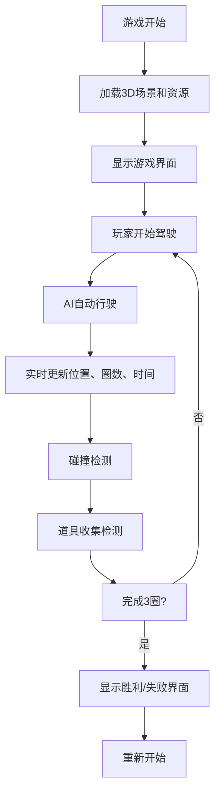

## 1. 产品概述

基于Three.js的3D赛车游戏网页，玩家在椭圆形轨道上与AI赛车竞速，完成3圈后决出胜负。游戏融合了速度感、策略性和趣味性，支持道具收集、碰撞系统、自定义场景等丰富功能。

- 核心目标：提供沉浸式的3D赛车体验，玩家通过键盘控制与AI竞争
- 目标用户：休闲游戏爱好者，Web 3D技术展示场景

## 2. 核心功能

### 2.1 功能模块
1. **主游戏场景**：3D椭圆形赛道、赛车模型、天空盒、光照系统
2. **控制系统**：玩家键盘控制（方向键控制速度和横向移动）
3. **AI系统**：电脑赛车自动沿轨道行驶并尝试超车
4. **游戏机制**：圈数统计、最快单圈计时、碰撞检测、道具收集
5. **UI界面**：速度表、圈数显示、最快圈时间、迷你地图
6. **设置系统**：轨道材质切换、天空盒切换、音效开关、重置按钮

### 2.2 页面详情
| 页面名称 | 模块名称 | 功能描述 |
|---------|---------|---------|
| 游戏主页面 | 3D场景渲染 | Three.js渲染椭圆形赛道、两辆赛车、天空盒、光照 |
| 游戏主页面 | 玩家控制 | 左右箭头横向移动，上下箭头控制速度 |
| 游戏主页面 | AI赛车 | 自动沿轨道行驶，智能超车 |
| 游戏主页面 | HUD界面 | 速度表、当前圈数、最快圈时间显示 |
| 游戏主页面 | 迷你地图 | 俯视视角显示两车位置 |
| 游戏主页面 | 设置面板 | 材质切换、天空盒切换、音效开关、重置按钮 |
| 游戏主页面 | 碰撞系统 | 两车相撞时玩家减速并显示特效 |
| 游戏主页面 | 道具系统 | 随机燃料瓶，收集后增加速度 |
| 游戏主页面 | 胜利/失败界面 | 完成3圈后显示结果 |

## 3. 核心流程

## 4. 用户界面设计

### 4.1 设计风格
- 主色调：深灰色赛道 + 亮红色玩家车 + 蓝色AI车
- 辅助色：白色边缘线、黄色速度表、绿色道具指示
- 字体：使用现代无衬线字体，数字使用等宽字体
- 布局：游戏画布全屏，HUD元素分布在四角，设置面板在右上角
- 风格：未来感、科技感、赛车游戏风格

### 4.2 页面设计概述
| 页面名称 | 模块名称 | UI元素 |
|---------|---------|--------|
| 游戏主页面 | 3D场景 | 椭圆形赛道居中，第三人称跟随相机 |
| 游戏主页面 | HUD左上 | 速度表（圆形仪表，0-200km/h） |
| 游戏主页面 | HUD右上 | 控制面板（材质切换、天空盒切换、音效开关、重置按钮） |
| 游戏主页面 | HUD左下 | 圈数显示（当前圈/总圈） |
| 游戏主页面 | HUD右下 | 最快圈时间 |
| 游戏主页面 | 迷你地图 | 右下角，俯视视角显示赛道轮廓和两车位置 |
| 游戏主页面 | 结果界面 | 居中半透明弹窗，显示胜利/失败文字和用时 |

### 4.3 响应式
- 桌面端优先设计
- 画布自适应窗口大小
- HUD元素使用固定定位，保持相对位置
- 移动端可缩小UI元素尺寸

### 4.4 3D场景指导
- **环境**：提供白天（蓝天白云）和夜晚（星空+霓虹）两种天空盒
- **光照**：白天用方向光+环境光，夜晚用点光源+环境光
- **相机**：第三人称跟随，始终在玩家车后方，可轻微跟随转向
- **动画**：车轮旋转、赛车倾斜、碰撞抖动、道具收集闪光
- **特效**：碰撞时的粒子效果、速度线、镜面反射材质的反光
