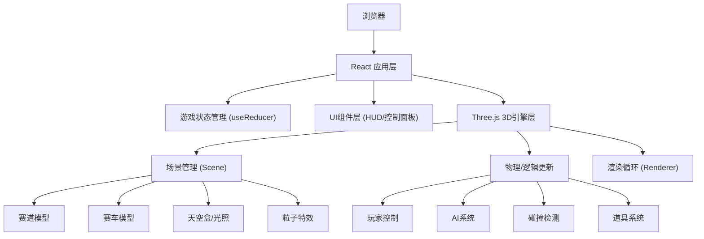
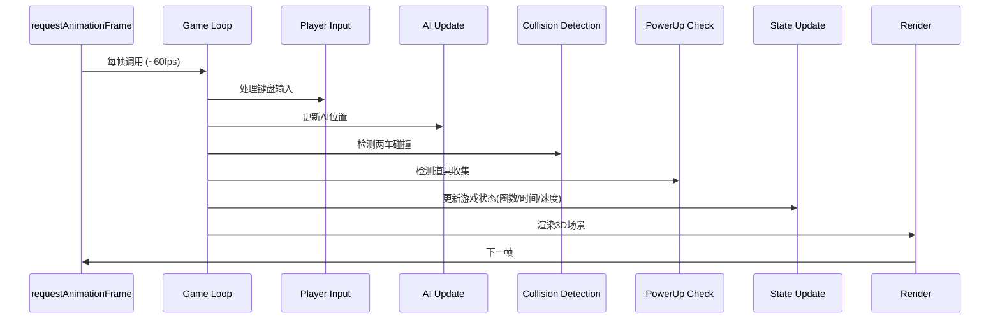

## 1. 架构设计



## 2. 技术描述

- **前端框架**: React@18 + Vite@5
- **3D引擎**: Three.js@0.160
- **状态管理**: React Hooks (useState, useReducer, useRef)
- **样式方案**: Tailwind CSS@3
- **音效**: Web Audio API (原生)
- **打包工具**: Vite
- **无后端依赖**，纯前端运行

## 3. 目录结构

```
src/
├── components/
│   ├── Game.tsx              # 游戏主组件
│   ├── HUD.tsx               # HUD界面组件
│   ├── ControlPanel.tsx      # 控制面板
│   ├── MiniMap.tsx           # 迷你地图
│   └── ResultModal.tsx       # 结果弹窗
├── game/
│   ├── types.ts              # 类型定义
│   ├── constants.ts          # 游戏常量
│   ├── utils.ts              # 工具函数
│   ├── Track.ts              # 赛道生成
│   ├── Car.ts                # 赛车类
│   ├── AIController.ts       # AI控制器
│   ├── PowerUp.ts            # 道具系统
│   └── SoundManager.ts       # 音效管理
├── App.tsx
├── main.tsx
└── index.css
```

## 4. 核心模块设计

### 4.1 游戏状态类型
```typescript
interface GameState {
  isPlaying: boolean;
  isPaused: boolean;
  currentLap: number;
  totalLaps: number;
  bestLapTime: number | null;
  currentLapStartTime: number;
  speed: number;
  trackMaterial: 'asphalt' | 'mirror';
  skybox: 'day' | 'night';
  soundEnabled: boolean;
  isCollision: boolean;
  collectedPowerUps: number;
  gameResult: 'win' | 'lose' | null;
}
```

### 4.2 赛道参数
```typescript
// 椭圆形赛道参数
const TRACK_PARAMS = {
  width: 12,           // 赛道宽度
  height: 0.2,         // 赛道厚度
  longAxis: 100,       // 长轴半径
  shortAxis: 60,       // 短轴半径
  segments: 128,       // 分段数
};
```

### 4.3 赛车物理参数
```typescript
const CAR_PARAMS = {
  maxSpeed: 1.2,       // 最大速度
  acceleration: 0.015, // 加速度
  deceleration: 0.02,  // 减速度
  turnSpeed: 0.03,     // 转向速度
  lateralSpeed: 0.08,  // 横向移动速度
};
```

## 5. 游戏循环设计



## 6. 关键实现方案

### 6.1 椭圆形赛道生成
- 使用 THREE.Shape 绘制椭圆轮廓
- 使用 ExtrudeGeometry 生成带厚度的赛道
- 边缘线使用 LineSegments 绘制白色线条
- 镜面材质使用 MeshStandardMaterial + envMap

### 6.2 赛车模型
- 车身：BoxGeometry (立方体)
- 车轮：4个 CylinderGeometry (圆柱体)
- 玩家车：红色材质，添加轻微发光效果
- AI车：蓝色材质

### 6.3 轨道行驶逻辑
- 使用参数方程计算椭圆上点的位置
- 每辆车维护一个轨道进度值 (0-1)
- 横向偏移控制车辆在赛道宽度内的位置
- AI根据玩家位置动态调整横向偏移以超车

### 6.4 相机跟随
- 相机位置 = 玩家位置 - 前进方向 × 距离 + 上方向 × 高度
- 使用 lerp 平滑相机移动
- 相机始终看向玩家前方一点

### 6.5 迷你地图
- 使用 2D Canvas 绘制
- 按比例缩放赛道和车辆位置
- 每帧更新车辆位置标记

### 6.6 音效系统
- 使用 Web Audio API 生成合成音效
- 引擎声：根据速度调制频率的振荡器
- 碰撞声：短促的噪音爆发
- 道具收集声：上升音阶
