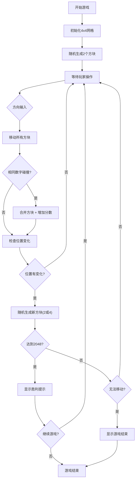

## 1. 产品概述

基于HTML、CSS和原生JavaScript的2048益智游戏，支持桌面和移动设备。玩家通过滑动操作合并相同数字方块，目标是合成2048或更高分数，同时提供丰富的自定义功能和游戏体验。

## 2. 核心特性

### 2.1 用户角色
| 角色 | 注册方法 | 核心权限 |
|------|----------|----------|
| 玩家 | 无需注册 | 游戏游玩、设置调整、分数记录 |

### 2.2 功能模块
1. **游戏主界面**：4x4游戏网格、分数显示、控制按钮
2. **游戏设置**：主题切换、难度选择、音效开关
3. **分数系统**：当前分数、最高分、排行榜
4. **游戏状态**：撤销、自动保存、进度恢复
5. **交互系统**：键盘控制、触摸滑动、动画效果

### 2.3 页面详情
| 页面名称 | 模块名称 | 功能描述 |
|-----------|-------------|---------------------|
| 游戏主页面 | 游戏网格 | 4x4方块布局、数字显示、合并动画 |
| 游戏主页面 | 分数面板 | 当前分数、最高分、里程碑提示 |
| 游戏主页面 | 控制面板 | 新游戏、撤销、难度、主题、音效 |
| 游戏主页面 | 排行榜 | 前5名最高分展示 |
| 游戏主页面 | 预览功能 | 下一个方块生成位置预览 |

## 3. 核心流程

## 4. 用户界面设计

### 4.1 设计风格
- **主色调**：暖橙色系 (#f2b179, #edc22e) 代表活力与能量
- **背景色**：浅色主题使用 #bbada0，深色主题使用 #1a1a2e
- **按钮风格**：圆角矩形，微立体效果，悬停时有轻微上浮动画
- **字体**：Clear Sans 或系统无衬线字体，粗体数字显示
- **布局风格**：卡片式布局，居中对称，充足留白
- **图标风格**：简洁的 Unicode 图标或 SVG，与主题配色一致

### 4.2 页面设计概述
| 页面名称 | 模块名称 | UI 元素 |
|-----------|-------------|-------------|
| 游戏主页面 | 游戏网格 | 4x4 圆角方块网格、不同数字对应不同颜色、平滑过渡动画、合并时缩放效果 |
| 游戏主页面 | 分数面板 | 卡片式分数容器、分数增加动画、最高分标识 |
| 游戏主页面 | 控制面板 | 横向排列按钮组、图标+文字组合、状态切换按钮 |
| 游戏主页面 | 排行榜 | 模态框弹出、排名列表、分数高亮 |

### 4.3 响应式设计
- **桌面优先**：PC端完整功能展示，键盘操作
- **平板适配**：保持比例缩放，触摸操作支持
- **手机优化**：单列布局，增大触摸区域，滑动操作
- **触摸优化**：滑动手势识别，最小44px触摸目标

### 4.4 动画与交互
- **方块移动**：CSS transition 平滑位置变化 (100ms)
- **方块合并**：scale 缩放动画 + 弹跳效果
- **新方块生成**：淡入 + 放大效果
- **主题切换**：颜色渐变过渡 (300ms)
- **分数增加**：数字滚动动画
- **里程碑提示**：浮动庆祝动画 + 彩带效果
