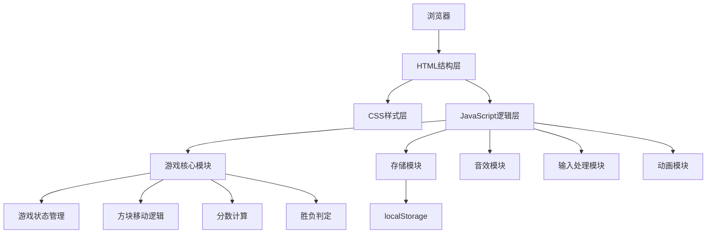

## 1. 架构设计



## 2. 技术描述

- **前端技术栈**：纯原生 HTML5 + CSS3 + JavaScript (ES6+)
- **无需构建工具**：直接浏览器运行，零依赖
- **数据存储**：浏览器 localStorage
- **音频处理**：Web Audio API
- **动画实现**：CSS3 transitions + keyframes 动画

## 3. 项目结构

| 文件 | 目的 |
|-------|---------|
| index.html | 游戏主页面结构 |
| style.css | 样式定义、主题变量、动画 |
| game.js | 游戏核心逻辑 |
| storage.js | 本地存储管理 |
| audio.js | 音效处理模块 |

## 4. 核心数据结构

### 4.1 游戏状态

```javascript
{
  grid: [[0,0,0,0],[0,0,0,0],[0,0,0,0],[0,0,0,0]],  // 4x4网格
  score: 0,           // 当前分数
  bestScore: 0,       // 最高分
  won: false,         // 是否获胜
  over: false,        // 是否结束
  keepPlaying: false  // 胜利后是否继续
}
```

### 4.2 难度配置

```javascript
{
  easy: { fourProbability: 0.1 },   // 简单：10%概率生成4
  normal: { fourProbability: 0.2 }, // 普通：20%概率生成4
  hard: { fourProbability: 0.4 }    // 困难：40%概率生成4
}
```

### 4.3 分数里程碑

```javascript
[128, 256, 512, 1024, 2048, 4096, 8192]
```

## 5. 核心模块设计

### 5.1 游戏核心模块 (Game)
- `init()`: 初始化游戏
- `move(direction)`: 处理移动逻辑
- `addRandomTile()`: 添加随机方块
- `canMove()`: 检查是否可移动
- `saveState()`: 保存当前状态用于撤销
- `undo()`: 撤销上一步

### 5.2 存储模块 (Storage)
- `saveGame()`: 保存游戏进度
- `loadGame()`: 加载游戏进度
- `saveBestScore()`: 保存最高分
- `saveLeaderboard()`: 保存排行榜
- `loadLeaderboard()`: 加载排行榜

### 5.3 音效模块 (Audio)
- `playMove()`: 移动音效
- `playMerge()`: 合并音效
- `playWin()`: 胜利音效
- `playGameOver()`: 游戏结束音效
- `toggle()`: 开关音效

### 5.4 输入处理模块 (Input)
- `handleKeydown()`: 键盘事件处理
- `handleTouch()`: 触摸滑动处理
- `detectSwipe()`: 滑动方向识别

### 5.5 动画模块 (Animation)
- `animateTileMove()`: 方块移动动画
- `animateTileMerge()`: 方块合并动画
- `animateNewTile()`: 新方块出现动画
- `animateScorePopup()`: 分数弹出动画
- `celebrateMilestone()`: 里程碑庆祝动画

## 6. localStorage 数据结构

```javascript
{
  "2048_gameState": { ... },      // 游戏进度
  "2048_bestScore": 0,            // 最高分
  "2048_leaderboard": [...],      // 排行榜前5
  "2048_theme": "light",          // 主题设置
  "2048_difficulty": "normal",    // 难度设置
  "2048_soundEnabled": true       // 音效开关
}
```

## 7. 方块颜色配置

| 数字 | 背景色 | 文字色 |
|------|--------|--------|
| 2 | #eee4da | #776e65 |
| 4 | #ede0c8 | #776e65 |
| 8 | #f2b179 | #f9f6f2 |
| 16 | #f59563 | #f9f6f2 |
| 32 | #f67c5f | #f9f6f2 |
| 64 | #f65e3b | #f9f6f2 |
| 128 | #edcf72 | #f9f6f2 |
| 256 | #edcc61 | #f9f6f2 |
| 512 | #edc850 | #f9f6f2 |
| 1024 | #edc53f | #f9f6f2 |
| 2048 | #edc22e | #f9f6f2 |
| super | #3c3a32 | #f9f6f2 |
