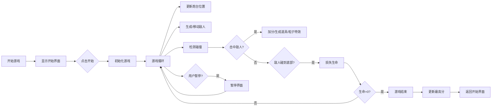

## 1. 产品概述

太空射击小游戏，玩家控制底部炮台消灭从顶部出现的敌人。
- 休闲娱乐类游戏，适合各年龄段用户
- 支持PC和移动端游玩，具有完整的游戏机制和进度系统

## 2. 核心功能

### 2.1 Feature Module
1. **游戏主界面**：游戏画布、分数显示、生命值显示
2. **玩家控制系统**：鼠标/触摸控制炮台瞄准、发射子弹
3. **敌人系统**：三种敌人类型（普通、快速、装甲）
4. **道具系统**：加速子弹、双倍得分、额外生命
5. **音效系统**：射击、击中、损失生命、游戏结束音效
6. **进度系统**：最高分记录、难度递增
7. **控制系统**：暂停/恢复、音效开关

### 2.2 功能详情
| 功能模块 | 功能描述 |
|---------|---------|
| 炮台控制 | 鼠标/触摸位置控制炮台瞄准角度 |
| 子弹发射 | 点击发射，最多同时5颗子弹 |
| 敌人生成 | 从顶部随机生成，左右移动遇边界反弹 |
| 敌人类型 | 普通(1分)、快速(2分)、装甲(3分需3次击中) |
| 道具掉落 | 敌人死亡随机掉落3种道具 |
| 背景效果 | 星空背景滚动营造飞行感 |
| 粒子特效 | 敌人被击中时显示爆炸粒子 |
| 难度递增 | 每100分敌人速度提升 |
| 游戏暂停 | 支持暂停/恢复游戏 |
| 数据持久化 | 最高分保存在localStorage |
| 触屏适配 | 支持移动设备触摸操作 |

## 3. 核心流程

## 4. 用户界面设计

### 4.1 设计风格
- **主色调**：深蓝色太空主题（#0a0a1a），霓虹蓝（#00d4ff），霓虹红（#ff3366）
- **辅助色**：绿色（#00ff88）表示生命，黄色（#ffcc00）表示得分
- **字体**：Orbitron 太空科技字体
- **视觉风格**：复古街机风格，发光边框，粒子特效
- **按钮样式**：圆角矩形，发光悬停效果

### 4.2 界面布局
| 界面 | 元素布局 |
|------|---------|
| 开始界面 | 居中显示游戏标题、最高分、开始按钮、音效开关 |
| 游戏界面 | 顶部显示分数/生命值，全屏游戏画布 |
| 暂停界面 | 半透明遮罩+居中暂停菜单 |
| 结束界面 | 居中显示最终得分、最高分、重新开始按钮 |

### 4.3 响应式设计
- 桌面端：画布自适应窗口大小，鼠标操作
- 移动端：全屏画布，触摸操作，优化按钮大小

