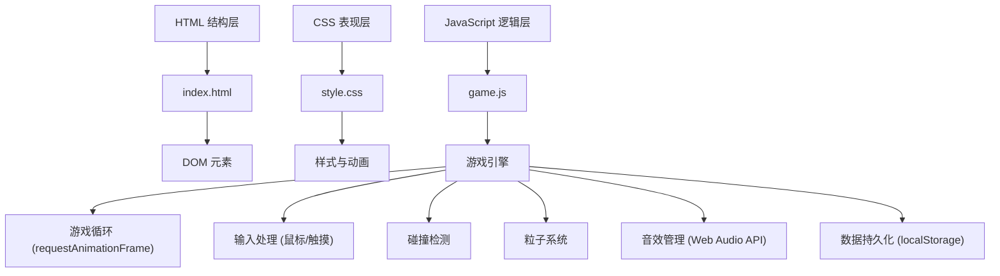

## 1. 技术架构



## 2. 技术栈说明

- **前端**：纯HTML5 + CSS3 + 原生JavaScript (ES6+)
- **渲染**：Canvas 2D API
- **音效**：Web Audio API 生成合成音效
- **数据存储**：localStorage
- **构建工具**：无（纯静态文件）

## 3. 文件结构

| 文件 | 职责 |
|------|------|
| index.html | 页面结构、Canvas元素、UI界面 |
| style.css | 全局样式、UI组件、动画效果 |
| game.js | 游戏核心逻辑、对象管理、游戏循环 |

## 4. 核心数据模型

### 4.1 游戏状态
```javascript
GameState = {
  score: number,      // 当前得分
  lives: number,      // 剩余生命
  highScore: number,  // 最高分
  isPlaying: boolean, // 游戏进行中
  isPaused: boolean,  // 暂停状态
  soundEnabled: boolean, // 音效开关
  difficulty: number  // 难度等级
}
```

### 4.2 游戏对象
```javascript
Turret = { x, y, angle, width, height }
Bullet = { x, y, vx, vy, radius, speedBoost }
Enemy = { x, y, type, health, maxHealth, speed, points, direction }
PowerUp = { x, y, type, vy }
Particle = { x, y, vx, vy, life, maxLife, color, size }
Star = { x, y, size, speed }
```

## 5. 核心模块

### 5.1 游戏循环
- 使用 `requestAnimationFrame` 实现60fps游戏循环
- 分离更新逻辑和渲染逻辑

### 5.2 碰撞检测
- AABB包围盒检测（子弹-敌人）
- 距离检测（炮台-敌人、玩家-道具）

### 5.3 音效系统
- Web Audio API 合成音效
- 支持静音切换

### 5.4 输入处理
- 鼠标事件：mousemove, mousedown
- 触摸事件：touchmove, touchstart
- 键盘事件：Escape（暂停）
