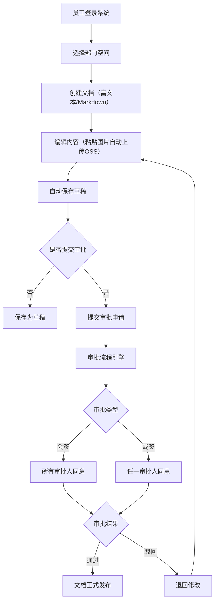
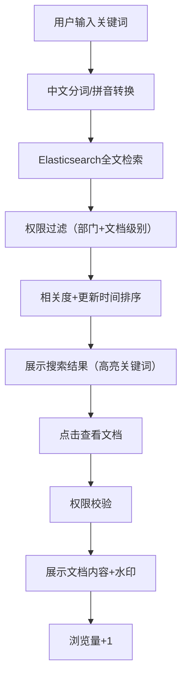
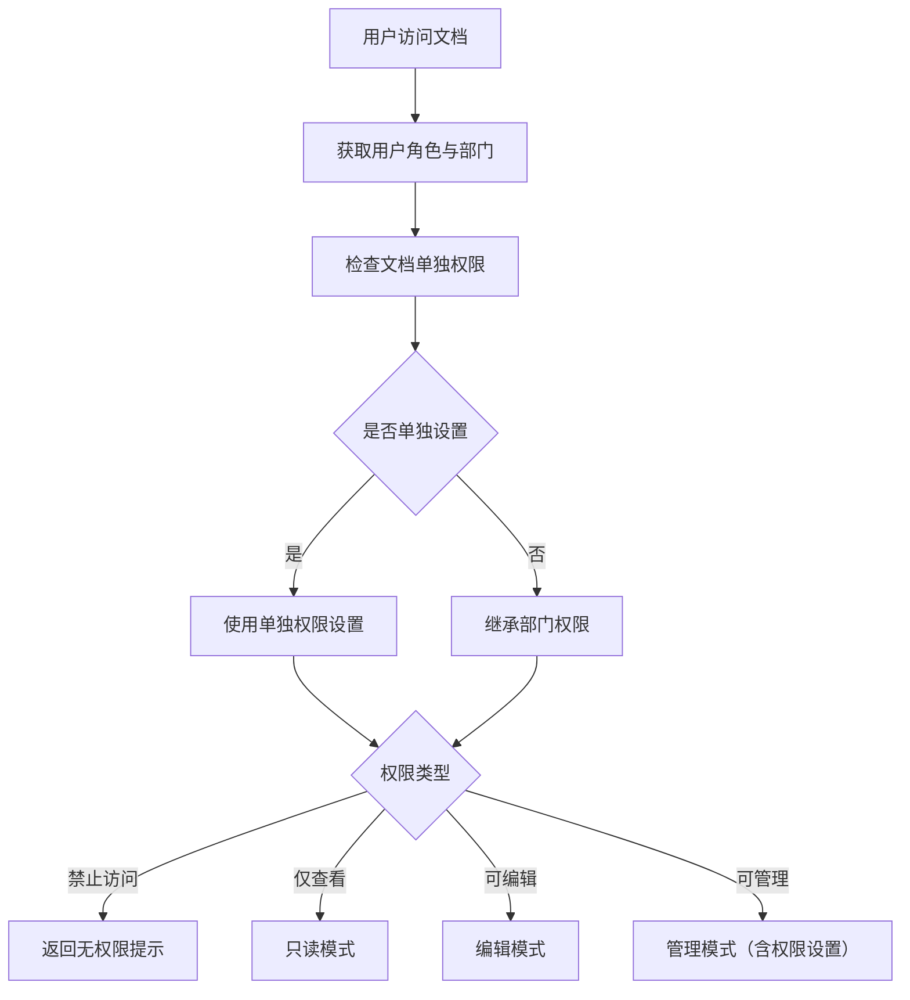

## 1. 产品概述

本项目是面向企业内部的知识库管理系统，旨在构建一个集中化、安全可控的知识沉淀与共享平台。系统支持多部门独立空间管理、文档多版本控制、审批发布流程、精细化权限管控、智能全文检索等核心功能，帮助企业实现知识资产的高效管理和价值最大化。

### 1.1 产品目标
- 构建企业级知识沉淀平台，实现知识资产的集中化管理
- 支持多部门独立空间，保障各部门数据安全与隔离
- 通过版本管理和审批流程确保文档质量与合规性
- 提供智能检索和双向链接，提升知识获取效率
- 集成LDAP单点登录，降低运维成本，提升用户体验

---

## 2. 核心功能

### 2.1 用户角色

| 角色 | 注册方式 | 核心权限 |
|------|----------|----------|
| 超级管理员 | 系统初始化 | 系统全局配置、用户管理、模板管理、API Token管理 |
| 部门管理员 | LDAP同步/管理员创建 | 部门成员管理、部门空间配置、部门文档管理 |
| 部门主管 | LDAP同步/管理员指定 | 文档审批、部门文档审核、成员权限分配 |
| 普通员工 | LDAP同步 | 文档创建编辑、查看、评论、点赞、提交审批 |
| 外部系统 | API Token | 通过API接口访问授权文档内容 |

### 2.2 功能模块

1. **登录与个人中心**：LDAP单点登录、个人信息修改、密码管理、访问记录
2. **部门架构管理**：部门树管理、部门成员管理、部门空间配置
3. **文档管理**：文档创建（富文本/Markdown）、图片粘贴上传OSS、文档分类、标签管理
4. **版本管理**：版本历史记录、版本对比、版本回滚
5. **审批流程**：审批发起、会签审批、或签审批、审批记录、驳回修改
6. **权限管理**：部门权限继承、文档单独授权、权限类型（查看/编辑/管理/禁止）
7. **全文检索**：中文分词搜索、拼音搜索、相关度排序、时间排序
8. **双向链接**：文档内链接、反向链接图谱、关联文档推荐
9. **文档模板**：模板创建管理、模板分类（立项报告/周报/技术方案等）
10. **互动功能**：文档评论（二级回复）、@通知、点赞功能
11. **热门排行**：每周自动生成热门文档排行榜（浏览量+点赞+评论综合计算）
12. **水印功能**：页面水印（用户名+时间）、防止截屏泄露
13. **文档导出**：PDF导出、Word导出、保留目录结构和格式
14. **回收站**：删除文档保留30天、手动恢复、自动清理
15. **API接口**：API Token管理、文档内容开放接口、调用日志
16. **系统管理**：系统配置、操作日志、数据统计

### 2.3 页面详情

| 页面名称 | 模块名称 | 功能描述 |
|---------|---------|----------|
| 登录页 | LDAP登录 | 用户名密码登录、LDAP认证、忘记密码 |
| 首页 | 工作台 | 最近文档、热门文档、我的待办、快捷创建入口 |
| 部门空间页 | 部门导航 | 部门树、部门文档列表、空间切换、最近更新 |
| 文档列表页 | 文档浏览 | 列表视图、网格视图、筛选、排序、搜索 |
| 文档详情页 | 文档阅读 | 内容展示、目录导航、版本切换、水印展示 |
| 文档编辑页 | 文档创作 | 富文本编辑器、Markdown编辑器、图片粘贴上传、自动保存 |
| 版本历史页 | 版本管理 | 版本列表、版本对比、回滚操作、版本备注 |
| 审批流程页 | 审批管理 | 待我审批、我发起的、审批详情、会签/或签操作 |
| 权限设置页 | 权限管控 | 部门权限、单独授权、权限类型选择、权限继承配置 |
| 搜索结果页 | 智能检索 | 搜索结果列表、高亮显示、筛选条件、相关度排序 |
| 反向链接图谱页 | 知识图谱 | 链接关系可视化、节点拖拽、关联文档跳转 |
| 模板中心页 | 模板管理 | 模板分类、模板预览、使用模板创建文档 |
| 热门排行页 | 数据统计 | 周排行榜、分类排行榜、综合得分展示 |
| 回收站页 | 数据恢复 | 删除文档列表、恢复操作、永久删除、清理倒计时 |
| 个人中心页 | 个人设置 | 个人信息、修改密码、访问记录、我的收藏 |
| 系统管理页 | 后台管理 | 用户管理、部门管理、API Token管理、系统配置 |

---

## 3. 核心流程

### 3.1 文档创作发布流程

### 3.2 文档检索与浏览流程

### 3.3 权限控制流程

---

## 4. 用户界面设计

### 4.1 设计风格

- **设计方向**：专业、高效、商务简约风格
- **主色调**：深海蓝 `#1E40AF`、科技蓝 `#3B82F6`
- **辅助色**：成功绿 `#10B981`、警告橙 `#F59E0B`、危险红 `#EF4444`
- **中性色**：深灰 `#1F2937`、中灰 `#6B7280`、浅灰 `#F3F4F6`、纯白 `#FFFFFF`
- **按钮风格**：圆角4px、悬停微上浮、点击反馈动画
- **字体**：标题使用 Noto Sans SC（思源黑体）Bold，正文使用 Noto Sans SC Regular
- **布局**：左侧导航树 + 顶部工具栏 + 主内容区的经典三栏布局
- **图标**：使用 lucide-vue-next 图标库，保持线性风格统一

### 4.2 页面设计概览

| 页面名称 | 模块名称 | UI元素 |
|---------|---------|--------|
| 登录页 | 登录卡片 | 居中卡片布局、渐变背景、Logo展示、表单验证、提交动画 |
| 首页 | 工作台 | 顶部欢迎语、快捷入口卡片、最近文档列表、热门文档排行、待办审批卡片 |
| 文档列表页 | 列表区域 | 面包屑导航、视图切换（列表/网格）、筛选栏、搜索框、文档卡片、分页 |
| 文档编辑页 | 编辑区域 | 顶部工具栏（模式切换/保存/提交审批）、左侧目录、中间编辑区、右侧属性面板 |
| 文档详情页 | 阅读区域 | 顶部操作栏、左侧目录导航、正文阅读区、底部评论区、右侧信息面板 |
| 权限设置页 | 权限表格 | 部门权限配置区、单独授权列表、权限类型下拉选择、成员搜索添加 |
| 搜索结果页 | 结果列表 | 搜索框（带拼音提示）、筛选侧边栏、结果卡片（关键词高亮）、排序切换 |
| 反向链接图谱页 | 图谱区域 | 画布区域、力导向图布局、节点悬浮提示、缩放控制、关联列表 |

### 4.3 交互细节

- **文档编辑**：支持 `Ctrl+S` 快捷保存、`Ctrl+B` 加粗、`Ctrl+I` 斜体等快捷键
- **图片上传**：剪贴板粘贴自动上传，拖拽上传，上传进度条展示
- **评论@功能**：输入 `@` 弹出用户选择列表，支持模糊搜索，发送后站内信通知
- **水印展示**：全屏半透明斜向水印，内容为「用户名 - YYYY-MM-DD HH:mm」
- **审批操作**：审批通过/驳回按钮高亮，审批意见输入框，会签状态进度展示

### 4.4 响应式设计

- **桌面端（>1200px）**：完整三栏布局，左侧导航展开，右侧面板可折叠
- **平板端（768px-1200px）**：左侧导航可折叠收起，右侧面板默认隐藏
- **移动端（<768px）**：底部Tab导航，文档阅读优先，编辑功能简化
- **触摸操作**：双击放大图片，长按显示操作菜单，滑动返回上一页

### 4.5 无障碍设计

- 所有交互元素支持键盘导航（Tab键切换）
- 图片添加alt描述，表单标签关联输入框
- 颜色对比度符合WCAG AA标准
- 支持屏幕阅读器朗读文档内容
