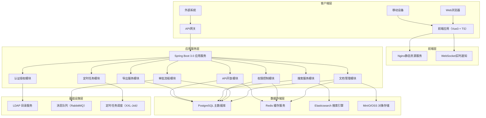
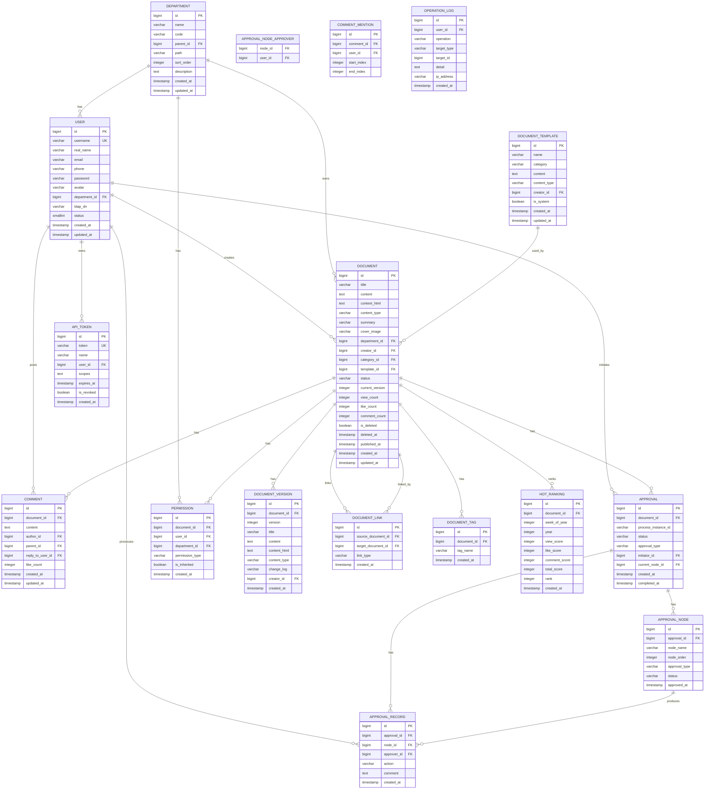

## 1. 总体架构设计



---

## 2. 技术描述

### 2.1 前端技术栈

| 技术 | 版本 | 用途 |
|------|------|------|
| **Vue** | ^3.4.0 | 前端核心框架，Composition API |
| **TypeScript** | ^5.3.0 | 类型安全的JavaScript超集 |
| **Vite** | ^5.0.0 | 前端构建工具 |
| **Vue Router** | ^4.2.0 | 前端路由管理 |
| **Pinia** | ^2.1.0 | 状态管理（替代Vuex） |
| **TailwindCSS** | ^3.4.0 | 原子化CSS框架 |
| **Tiptap** | ^2.1.0 | 富文本编辑器（ProseMirror封装） |
| **Marked** | ^11.1.0 | Markdown解析器 |
| **CodeMirror** | ^6.0.0 | Markdown代码编辑器 |
| **D3.js** | ^7.8.0 | 反向链接图谱可视化 |
| **Lucide Vue Next** | ^0.294.0 | 图标库 |
| **Axios** | ^1.6.0 | HTTP请求库 |
| **Day.js** | ^1.11.0 | 日期时间处理 |
| **jsPDF** | ^3.0.0 | PDF导出 |
| **html-docx-js** | ^0.3.1 | Word导出 |

### 2.2 后端技术栈

| 技术 | 版本 | 用途 |
|------|------|------|
| **Spring Boot** | 3.2.x | 后端核心框架 |
| **Spring Security** | 6.2.x | 安全认证框架 |
| **Spring Data JPA** | 3.2.x | ORM数据访问 |
| **Spring Data Redis** | 3.2.x | Redis数据访问 |
| **Spring Data Elasticsearch** | 5.2.x | Elasticsearch数据访问 |
| **PostgreSQL** | 16.x | 关系型数据库 |
| **Redis** | 7.x | 缓存服务 |
| **Elasticsearch** | 8.11.x | 全文搜索引擎 |
| **IK Analyzer** | 8.x | 中文分词器 |
| **pinyin-analyzer** | 8.x | 拼音分词器 |
| **Flowable** | 7.0.x | 工作流引擎 |
| **MinIO** | 2023.x | 对象存储服务 |
| **RabbitMQ** | 3.12.x | 消息队列 |
| **Spring LDAP** | 3.2.x | LDAP集成 |
| **JWT** | 0.12.x | Token认证 |
| **XXL-Job** | 2.4.x | 分布式定时任务 |
| **Knife4j** | 4.4.x | API文档 |

### 2.3 项目结构

#### 前端项目结构
```
knowledge-base-frontend/
├── public/
│   └── favicon.ico
├── src/
│   ├── api/                    # API接口定义
│   │   ├── auth.ts
│   │   ├── document.ts
│   │   ├── department.ts
│   │   ├── approval.ts
│   │   └── search.ts
│   ├── assets/                 # 静态资源
│   │   ├── images/
│   │   └── styles/
│   │       └── index.css
│   ├── components/             # 通用组件
│   │   ├── layout/
│   │   │   ├── MainLayout.vue
│   │   │   ├── Sidebar.vue
│   │   │   └── Header.vue
│   │   ├── editor/
│   │   │   ├── RichTextEditor.vue
│   │   │   ├── MarkdownEditor.vue
│   │   │   └── ImageUploader.vue
│   │   ├── common/
│   │   │   ├── Watermark.vue
│   │   │   ├── Breadcrumb.vue
│   │   │   └── Pagination.vue
│   │   └── permission/
│   │       └── PermissionGuard.vue
│   ├── composables/            # 组合式函数
│   │   ├── useAuth.ts
│   │   ├── useDocument.ts
│   │   ├── usePermission.ts
│   │   └── useWatermark.ts
│   ├── layouts/                # 布局组件
│   ├── pages/                  # 页面组件
│   │   ├── Login.vue
│   │   ├── Home.vue
│   │   ├── document/
│   │   │   ├── List.vue
│   │   │   ├── Detail.vue
│   │   │   ├── Edit.vue
│   │   │   └── VersionHistory.vue
│   │   ├── department/
│   │   │   └── Space.vue
│   │   ├── approval/
│   │   │   ├── Pending.vue
│   │   │   └── Detail.vue
│   │   ├── search/
│   │   │   └── Result.vue
│   │   └── admin/
│   │       ├── UserManage.vue
│   │       ├── DepartmentManage.vue
│   │       └── TemplateManage.vue
│   ├── router/                 # 路由配置
│   │   └── index.ts
│   ├── stores/                 # Pinia状态管理
│   │   ├── user.ts
│   │   ├── app.ts
│   │   └── document.ts
│   ├── types/                  # TypeScript类型定义
│   │   ├── user.ts
│   │   ├── document.ts
│   │   ├── approval.ts
│   │   └── api.ts
│   ├── utils/                  # 工具函数
│   │   ├── request.ts
│   │   ├── permission.ts
│   │   ├── date.ts
│   │   └── export.ts
│   ├── App.vue
│   └── main.ts
├── index.html
├── package.json
├── tsconfig.json
├── vite.config.ts
├── tailwind.config.js
└── postcss.config.js
```

#### 后端项目结构
```
knowledge-base-backend/
├── src/
│   └── main/
│       ├── java/
│       │   └── com/company/knowledge/
│       │       ├── KnowledgeApplication.java
│       │       ├── config/          # 配置类
│       │       │   ├── SecurityConfig.java
│       │       │   ├── RedisConfig.java
│       │       │   ├── ElasticsearchConfig.java
│       │       │   ├── FlowableConfig.java
│       │       │   ├── MinioConfig.java
│       │       │   └── LdapConfig.java
│       │       ├── controller/      # 控制器层
│       │       │   ├── AuthController.java
│       │       │   ├── UserController.java
│       │       │   ├── DepartmentController.java
│       │       │   ├── DocumentController.java
│       │       │   ├── DocumentVersionController.java
│       │       │   ├── ApprovalController.java
│       │       │   ├── PermissionController.java
│       │       │   ├── SearchController.java
│       │       │   ├── TemplateController.java
│       │       │   ├── CommentController.java
│       │       │   ├── RecycleBinController.java
│       │       │   ├── ExportController.java
│       │       │   └── OpenApiController.java
│       │       ├── service/         # 服务层
│       │       │   ├── AuthService.java
│       │       │   ├── UserService.java
│       │       │   ├── DepartmentService.java
│       │       │   ├── DocumentService.java
│       │       │   ├── DocumentVersionService.java
│       │       │   ├── ApprovalService.java
│       │       │   ├── PermissionService.java
│       │       │   ├── SearchService.java
│       │       │   ├── TemplateService.java
│       │       │   ├── CommentService.java
│       │       │   ├── FileStorageService.java
│       │       │   ├── RecycleBinService.java
│       │       │   ├── ExportService.java
│       │       │   ├── RankingService.java
│       │       │   ├── LdapUserService.java
│       │       │   └── OpenApiService.java
│       │       ├── repository/      # 数据访问层
│       │       │   ├── UserRepository.java
│       │       │   ├── DepartmentRepository.java
│       │       │   ├── DocumentRepository.java
│       │       │   ├── DocumentVersionRepository.java
│       │       │   ├── ApprovalRepository.java
│       │       │   ├── PermissionRepository.java
│       │       │   ├── TemplateRepository.java
│       │       │   ├── CommentRepository.java
│       │       │   ├── DocumentSearchRepository.java
│       │       │   └── ApiTokenRepository.java
│       │       ├── entity/          # 实体类
│       │       │   ├── User.java
│       │       │   ├── Department.java
│       │       │   ├── Document.java
│       │       │   ├── DocumentVersion.java
│       │       │   ├── Approval.java
│       │       │   ├── ApprovalNode.java
│       │       │   ├── Permission.java
│       │       │   ├── DocumentTemplate.java
│       │       │   ├── Comment.java
│       │       │   ├── DocumentLink.java
│       │       │   ├── DocumentTag.java
│       │       │   ├── ApiToken.java
│       │       │   ├── HotRanking.java
│       │       │   └── OperationLog.java
│       │       ├── dto/             # 数据传输对象
│       │       │   ├── request/
│       │       │   └── response/
│       │       ├── vo/              # 视图对象
│       │       ├── common/          # 公共模块
│       │       │   ├── enums/       # 枚举类
│       │       │   ├── exception/   # 异常处理
│       │       │   ├── annotation/  # 自定义注解
│       │       │   └── utils/       # 工具类
│       │       ├── security/        # 安全模块
│       │       │   ├── jwt/
│       │       │   ├── filter/
│       │       │   └── handler/
│       │       ├── job/             # 定时任务
│       │       │   ├── HotRankingJob.java
│       │       │   └── RecycleBinCleanJob.java
│       │       └── es/              # Elasticsearch文档
│       │           └── DocumentEs.java
│       └── resources/
│           ├── application.yml
│           ├── application-dev.yml
│           ├── application-prod.yml
│           └── process/             # 流程定义
│               └── document-approval.bpmn20.xml
└── pom.xml
```

---

## 3. 路由定义

| 路由路径 | 页面名称 | 权限要求 | 说明 |
|---------|---------|---------|------|
| `/login` | 登录页 | 公开 | LDAP单点登录页面 |
| `/` | 首页/工作台 | 登录用户 | 最近文档、热门排行、待办审批 |
| `/department/:deptId` | 部门空间页 | 部门成员 | 部门文档列表、部门导航 |
| `/documents` | 文档列表页 | 登录用户 | 所有可访问文档列表 |
| `/documents/:docId` | 文档详情页 | 文档查看权限 | 文档阅读、评论、点赞 |
| `/documents/:docId/edit` | 文档编辑页 | 文档编辑权限 | 富文本/Markdown编辑 |
| `/documents/:docId/versions` | 版本历史页 | 文档查看权限 | 版本对比、回滚 |
| `/documents/:docId/links` | 反向链接图谱 | 文档查看权限 | 链接关系可视化 |
| `/documents/create` | 创建文档 | 部门成员 | 选择模板、创建新文档 |
| `/approval/pending` | 待我审批 | 审批人角色 | 待审批文档列表 |
| `/approval/initiated` | 我发起的 | 登录用户 | 我发起的审批流程 |
| `/approval/:approvalId` | 审批详情 | 相关人员 | 审批操作、审批记录 |
| `/search` | 搜索结果页 | 登录用户 | 全文检索结果展示 |
| `/templates` | 模板中心 | 登录用户 | 模板列表、预览、使用 |
| `/recycle` | 回收站 | 登录用户 | 删除文档恢复、永久删除 |
| `/ranking` | 热门排行 | 登录用户 | 周排行榜、分类排行 |
| `/profile` | 个人中心 | 登录用户 | 个人信息、修改密码 |
| `/admin/users` | 用户管理 | 超级管理员 | 用户列表、用户管理 |
| `/admin/departments` | 部门管理 | 超级管理员 | 部门架构、部门管理 |
| `/admin/templates` | 模板管理 | 超级管理员 | 模板创建、编辑、删除 |
| `/admin/api-tokens` | API Token管理 | 超级管理员 | Token生成、权限配置 |
| `/admin/settings` | 系统设置 | 超级管理员 | 系统参数配置 |

---

## 4. API 定义

### 4.1 通用响应结构

```typescript
interface ApiResponse<T> {
  code: number;
  message: string;
  data: T;
  timestamp: number;
}

interface PageResult<T> {
  list: T[];
  total: number;
  page: number;
  pageSize: number;
}
```

### 4.2 用户相关

```typescript
// 用户登录
interface LoginRequest {
  username: string;
  password: string;
}

interface LoginResponse {
  token: string;
  refreshToken: string;
  userInfo: UserInfo;
}

interface UserInfo {
  id: number;
  username: string;
  realName: string;
  email: string;
  avatar: string;
  departmentId: number;
  departmentName: string;
  roles: string[];
  permissions: string[];
}

// 用户信息
interface User {
  id: number;
  username: string;
  realName: string;
  email: string;
  phone: string;
  avatar: string;
  departmentId: number;
  departmentName: string;
  status: 'ACTIVE' | 'DISABLED';
  roles: Role[];
  createdAt: string;
}

interface Role {
  id: number;
  name: string;
  code: string;
}
```

### 4.3 文档相关

```typescript
// 文档信息
interface Document {
  id: number;
  title: string;
  content: string;
  contentHtml: string;
  contentType: 'RICH_TEXT' | 'MARKDOWN';
  summary: string;
  coverImage: string;
  departmentId: number;
  departmentName: string;
  creatorId: number;
  creatorName: string;
  status: 'DRAFT' | 'PENDING' | 'PUBLISHED' | 'REJECTED';
  version: number;
  viewCount: number;
  likeCount: number;
  commentCount: number;
  tags: string[];
  categoryId: number;
  categoryName: string;
  templateId: number | null;
  isDeleted: boolean;
  deletedAt: string | null;
  createdAt: string;
  updatedAt: string;
  publishedAt: string | null;
}

// 文档版本
interface DocumentVersion {
  id: number;
  documentId: number;
  version: number;
  title: string;
  content: string;
  contentHtml: string;
  contentType: 'RICH_TEXT' | 'MARKDOWN';
  changeLog: string;
  creatorId: number;
  creatorName: string;
  createdAt: string;
}

// 文档链接
interface DocumentLink {
  id: number;
  sourceDocumentId: number;
  sourceDocumentTitle: string;
  targetDocumentId: number;
  targetDocumentTitle: string;
  linkType: 'INTERNAL' | 'EXTERNAL';
  createdAt: string;
}

// 创建文档请求
interface CreateDocumentRequest {
  title: string;
  contentType: 'RICH_TEXT' | 'MARKDOWN';
  departmentId: number;
  categoryId: number;
  templateId: number | null;
  tags: string[];
}

// 更新文档请求
interface UpdateDocumentRequest {
  title: string;
  content: string;
  contentType: 'RICH_TEXT' | 'MARKDOWN';
  tags: string[];
  categoryId: number;
  changeLog: string;
}

// 文档权限
interface DocumentPermission {
  id: number;
  documentId: number;
  userId: number | null;
  departmentId: number | null;
  user: User | null;
  department: Department | null;
  permissionType: 'VIEW' | 'EDIT' | 'MANAGE' | 'DENY';
  isInherited: boolean;
  createdAt: string;
}

// 权限类型枚举
type PermissionType = 'VIEW' | 'EDIT' | 'MANAGE' | 'DENY';
```

### 4.4 审批相关

```typescript
// 审批流
interface Approval {
  id: number;
  documentId: number;
  documentTitle: string;
  processInstanceId: string;
  status: 'PENDING' | 'APPROVED' | 'REJECTED' | 'CANCELED';
  approvalType: 'ALL_SIGN' | 'OR_SIGN';
  initiatorId: number;
  initiatorName: string;
  currentNodeId: number;
  currentNodeName: string;
  createdAt: string;
  completedAt: string | null;
}

// 审批节点
interface ApprovalNode {
  id: number;
  approvalId: number;
  nodeName: string;
  nodeOrder: number;
  approverIds: number[];
  approvers: User[];
  approvalType: 'ALL_SIGN' | 'OR_SIGN';
  status: 'PENDING' | 'APPROVED' | 'REJECTED' | 'SKIPPED';
  approvedAt: string | null;
}

// 审批记录
interface ApprovalRecord {
  id: number;
  approvalId: number;
  nodeId: number;
  approverId: number;
  approverName: string;
  action: 'APPROVE' | 'REJECT' | 'TRANSFER';
  comment: string;
  createdAt: string;
}

// 提交审批请求
interface SubmitApprovalRequest {
  documentId: number;
  approvalType: 'ALL_SIGN' | 'OR_SIGN';
  approverIds: number[];
  ccIds: number[];
}

// 审批操作请求
interface ProcessApprovalRequest {
  approvalId: number;
  action: 'APPROVE' | 'REJECT';
  comment: string;
}
```

### 4.5 搜索相关

```typescript
// 搜索请求
interface SearchRequest {
  keyword: string;
  departmentId?: number;
  categoryId?: number;
  contentType?: 'RICH_TEXT' | 'MARKDOWN';
  creatorId?: number;
  dateFrom?: string;
  dateTo?: string;
  sortBy?: 'RELEVANCE' | 'NEWEST' | 'MOST_VIEWED' | 'MOST_LIKED';
  page: number;
  pageSize: number;
}

// 搜索结果
interface SearchResult {
  documentId: number;
  title: string;
  titleHighlight: string;
  summary: string;
  summaryHighlight: string;
  contentType: 'RICH_TEXT' | 'MARKDOWN';
  departmentId: number;
  departmentName: string;
  creatorName: string;
  tags: string[];
  viewCount: number;
  likeCount: number;
  score: number;
  updatedAt: string;
}
```

### 4.6 评论相关

```typescript
interface Comment {
  id: number;
  documentId: number;
  content: string;
  authorId: number;
  authorName: string;
  authorAvatar: string;
  parentId: number | null;
  replyToUserId: number | null;
  replyToUserName: string | null;
  mentions: MentionUser[];
  isLiked: boolean;
  likeCount: number;
  createdAt: string;
  updatedAt: string;
}

interface MentionUser {
  userId: number;
  userName: string;
  startIndex: number;
  endIndex: number;
}

interface CreateCommentRequest {
  documentId: number;
  content: string;
  parentId: number | null;
  replyToUserId: number | null;
}
```

---

## 5. 服务端架构图

```mermaid
graph TD
    subgraph "展示层 Controller"
        A["AuthController"]
        B["UserController"]
        C["DepartmentController"]
        D["DocumentController"]
        E["ApprovalController"]
        F["PermissionController"]
        G["SearchController"]
        H["CommentController"]
        I["ExportController"]
        J["OpenApiController"]
    end

    subgraph "业务逻辑层 Service"
        K["AuthService"]
        L["UserService"]
        M["DepartmentService"]
        N["DocumentService"]
        O["DocumentVersionService"]
        P["ApprovalService"]
        Q["PermissionService"]
        R["SearchService"]
        S["CommentService"]
        T["FileStorageService"]
        U["ExportService"]
        V["RankingService"]
        W["LdapUserService"]
        X["OpenApiService"]
        Y["RecycleBinService"]
    end

    subgraph "数据访问层 Repository"
        Z["UserRepository"]
        AA["DepartmentRepository"]
        AB["DocumentRepository"]
        AC["DocumentVersionRepository"]
        AD["ApprovalRepository"]
        AE["PermissionRepository"]
        AF["DocumentSearchRepository"]
        AG["CommentRepository"]
        AH["ApiTokenRepository"]
        AI["TemplateRepository"]
    end

    subgraph "数据存储"
        AJ["PostgreSQL"]
        AK["Redis"]
        AL["Elasticsearch"]
        AM["MinIO/OSS"]
    end

    A --> K
    B --> L
    C --> M
    D --> N
    D --> O
    E --> P
    F --> Q
    G --> R
    H --> S
    I --> U
    J --> X

    K --> L
    K --> W
    K --> Z
    L --> Z
    M --> AA
    N --> AB
    N --> T
    N --> AK
    O --> AC
    P --> AD
    P --> AK
    Q --> AE
    Q --> AK
    R --> AF
    R --> AL
    S --> AG
    T --> AM
    V --> AJ
    V --> AK
    W --> AJ
    X --> AH
    X --> AK
    Y --> AB
    Y --> AJ
```



---

## 6. 数据模型

### 6.1 ER 图



### 6.2 DDL 语句

```sql
-- 用户表
CREATE TABLE t_user (
    id BIGSERIAL PRIMARY KEY,
    username VARCHAR(50) NOT NULL UNIQUE,
    real_name VARCHAR(50) NOT NULL,
    email VARCHAR(100),
    phone VARCHAR(20),
    password VARCHAR(255),
    avatar VARCHAR(500),
    department_id BIGINT,
    ldap_dn VARCHAR(255),
    status SMALLINT DEFAULT 1,
    created_at TIMESTAMP DEFAULT CURRENT_TIMESTAMP,
    updated_at TIMESTAMP DEFAULT CURRENT_TIMESTAMP
);
CREATE INDEX idx_user_department ON t_user(department_id);
CREATE INDEX idx_user_username ON t_user(username);

-- 部门表
CREATE TABLE t_department (
    id BIGSERIAL PRIMARY KEY,
    name VARCHAR(100) NOT NULL,
    code VARCHAR(50) NOT NULL UNIQUE,
    parent_id BIGINT,
    path VARCHAR(500) NOT NULL,
    sort_order INTEGER DEFAULT 0,
    description TEXT,
    created_at TIMESTAMP DEFAULT CURRENT_TIMESTAMP,
    updated_at TIMESTAMP DEFAULT CURRENT_TIMESTAMP
);
CREATE INDEX idx_department_parent ON t_department(parent_id);
CREATE INDEX idx_department_path ON t_department(path);

-- 文档表
CREATE TABLE t_document (
    id BIGSERIAL PRIMARY KEY,
    title VARCHAR(255) NOT NULL,
    content TEXT,
    content_html TEXT,
    content_type VARCHAR(20) NOT NULL,
    summary VARCHAR(500),
    cover_image VARCHAR(500),
    department_id BIGINT NOT NULL,
    creator_id BIGINT NOT NULL,
    category_id BIGINT,
    template_id BIGINT,
    status VARCHAR(20) NOT NULL DEFAULT 'DRAFT',
    current_version INTEGER NOT NULL DEFAULT 1,
    view_count INTEGER NOT NULL DEFAULT 0,
    like_count INTEGER NOT NULL DEFAULT 0,
    comment_count INTEGER NOT NULL DEFAULT 0,
    is_deleted BOOLEAN NOT NULL DEFAULT FALSE,
    deleted_at TIMESTAMP,
    published_at TIMESTAMP,
    created_at TIMESTAMP DEFAULT CURRENT_TIMESTAMP,
    updated_at TIMESTAMP DEFAULT CURRENT_TIMESTAMP
);
CREATE INDEX idx_document_department ON t_document(department_id);
CREATE INDEX idx_document_creator ON t_document(creator_id);
CREATE INDEX idx_document_status ON t_document(status);
CREATE INDEX idx_document_deleted ON t_document(is_deleted, deleted_at);
CREATE INDEX idx_document_updated ON t_document(updated_at DESC);
CREATE INDEX idx_document_title ON t_document(title);

-- 文档版本表
CREATE TABLE t_document_version (
    id BIGSERIAL PRIMARY KEY,
    document_id BIGINT NOT NULL,
    version INTEGER NOT NULL,
    title VARCHAR(255) NOT NULL,
    content TEXT,
    content_html TEXT,
    content_type VARCHAR(20) NOT NULL,
    change_log VARCHAR(500),
    creator_id BIGINT NOT NULL,
    created_at TIMESTAMP DEFAULT CURRENT_TIMESTAMP
);
CREATE INDEX idx_version_document ON t_document_version(document_id);
CREATE INDEX idx_version_version ON t_document_version(document_id, version DESC);

-- 文档链接表
CREATE TABLE t_document_link (
    id BIGSERIAL PRIMARY KEY,
    source_document_id BIGINT NOT NULL,
    target_document_id BIGINT NOT NULL,
    link_type VARCHAR(20) NOT NULL,
    created_at TIMESTAMP DEFAULT CURRENT_TIMESTAMP
);
CREATE INDEX idx_link_source ON t_document_link(source_document_id);
CREATE INDEX idx_link_target ON t_document_link(target_document_id);

-- 文档标签表
CREATE TABLE t_document_tag (
    id BIGSERIAL PRIMARY KEY,
    document_id BIGINT NOT NULL,
    tag_name VARCHAR(50) NOT NULL,
    created_at TIMESTAMP DEFAULT CURRENT_TIMESTAMP
);
CREATE INDEX idx_tag_document ON t_document_tag(document_id);
CREATE INDEX idx_tag_name ON t_document_tag(tag_name);

-- 文档模板表
CREATE TABLE t_document_template (
    id BIGSERIAL PRIMARY KEY,
    name VARCHAR(100) NOT NULL,
    category VARCHAR(50) NOT NULL,
    content TEXT NOT NULL,
    content_type VARCHAR(20) NOT NULL,
    creator_id BIGINT NOT NULL,
    is_system BOOLEAN NOT NULL DEFAULT FALSE,
    created_at TIMESTAMP DEFAULT CURRENT_TIMESTAMP,
    updated_at TIMESTAMP DEFAULT CURRENT_TIMESTAMP
);
CREATE INDEX idx_template_category ON t_document_template(category);

-- 审批表
CREATE TABLE t_approval (
    id BIGSERIAL PRIMARY KEY,
    document_id BIGINT NOT NULL,
    process_instance_id VARCHAR(64),
    status VARCHAR(20) NOT NULL,
    approval_type VARCHAR(20) NOT NULL,
    initiator_id BIGINT NOT NULL,
    current_node_id BIGINT,
    created_at TIMESTAMP DEFAULT CURRENT_TIMESTAMP,
    completed_at TIMESTAMP
);
CREATE INDEX idx_approval_document ON t_approval(document_id);
CREATE INDEX idx_approval_initiator ON t_approval(initiator_id);
CREATE INDEX idx_approval_status ON t_approval(status);

-- 审批节点表
CREATE TABLE t_approval_node (
    id BIGSERIAL PRIMARY KEY,
    approval_id BIGINT NOT NULL,
    node_name VARCHAR(50) NOT NULL,
    node_order INTEGER NOT NULL,
    approval_type VARCHAR(20) NOT NULL,
    status VARCHAR(20) NOT NULL,
    approved_at TIMESTAMP
);
CREATE INDEX idx_node_approval ON t_approval_node(approval_id);

-- 审批节点审批人关联表
CREATE TABLE t_approval_node_approver (
    node_id BIGINT NOT NULL,
    user_id BIGINT NOT NULL,
    PRIMARY KEY (node_id, user_id)
);

-- 审批记录表
CREATE TABLE t_approval_record (
    id BIGSERIAL PRIMARY KEY,
    approval_id BIGINT NOT NULL,
    node_id BIGINT NOT NULL,
    approver_id BIGINT NOT NULL,
    action VARCHAR(20) NOT NULL,
    comment TEXT,
    created_at TIMESTAMP DEFAULT CURRENT_TIMESTAMP
);
CREATE INDEX idx_record_approval ON t_approval_record(approval_id);

-- 评论表
CREATE TABLE t_comment (
    id BIGSERIAL PRIMARY KEY,
    document_id BIGINT NOT NULL,
    content TEXT NOT NULL,
    author_id BIGINT NOT NULL,
    parent_id BIGINT,
    reply_to_user_id BIGINT,
    like_count INTEGER NOT NULL DEFAULT 0,
    created_at TIMESTAMP DEFAULT CURRENT_TIMESTAMP,
    updated_at TIMESTAMP DEFAULT CURRENT_TIMESTAMP
);
CREATE INDEX idx_comment_document ON t_comment(document_id);
CREATE INDEX idx_comment_parent ON t_comment(parent_id);
CREATE INDEX idx_comment_author ON t_comment(author_id);

-- 评论@提及表
CREATE TABLE t_comment_mention (
    id BIGSERIAL PRIMARY KEY,
    comment_id BIGINT NOT NULL,
    user_id BIGINT NOT NULL,
    start_index INTEGER NOT NULL,
    end_index INTEGER NOT NULL
);
CREATE INDEX idx_mention_comment ON t_comment_mention(comment_id);
CREATE INDEX idx_mention_user ON t_comment_mention(user_id);

-- 权限表
CREATE TABLE t_permission (
    id BIGSERIAL PRIMARY KEY,
    document_id BIGINT,
    user_id BIGINT,
    department_id BIGINT,
    permission_type VARCHAR(20) NOT NULL,
    is_inherited BOOLEAN NOT NULL DEFAULT FALSE,
    created_at TIMESTAMP DEFAULT CURRENT_TIMESTAMP
);
CREATE INDEX idx_permission_document ON t_permission(document_id);
CREATE INDEX idx_permission_user ON t_permission(user_id);
CREATE INDEX idx_permission_department ON t_permission(department_id);

-- API Token表
CREATE TABLE t_api_token (
    id BIGSERIAL PRIMARY KEY,
    token VARCHAR(64) NOT NULL UNIQUE,
    name VARCHAR(100) NOT NULL,
    user_id BIGINT NOT NULL,
    scopes TEXT,
    expires_at TIMESTAMP,
    is_revoked BOOLEAN NOT NULL DEFAULT FALSE,
    created_at TIMESTAMP DEFAULT CURRENT_TIMESTAMP
);
CREATE INDEX idx_token_user ON t_api_token(user_id);

-- 热门排行表
CREATE TABLE t_hot_ranking (
    id BIGSERIAL PRIMARY KEY,
    document_id BIGINT NOT NULL,
    week_of_year INTEGER NOT NULL,
    year INTEGER NOT NULL,
    view_score INTEGER NOT NULL DEFAULT 0,
    like_score INTEGER NOT NULL DEFAULT 0,
    comment_score INTEGER NOT NULL DEFAULT 0,
    total_score INTEGER NOT NULL DEFAULT 0,
    rank INTEGER NOT NULL,
    created_at TIMESTAMP DEFAULT CURRENT_TIMESTAMP
);
CREATE INDEX idx_ranking_week ON t_hot_ranking(year, week_of_year);
CREATE INDEX idx_ranking_document ON t_hot_ranking(document_id);

-- 操作日志表
CREATE TABLE t_operation_log (
    id BIGSERIAL PRIMARY KEY,
    user_id BIGINT,
    operation VARCHAR(100) NOT NULL,
    target_type VARCHAR(50),
    target_id BIGINT,
    detail TEXT,
    ip_address VARCHAR(50),
    created_at TIMESTAMP DEFAULT CURRENT_TIMESTAMP
);
CREATE INDEX idx_log_user ON t_operation_log(user_id);
CREATE INDEX idx_log_operation ON t_operation_log(operation);
CREATE INDEX idx_log_created ON t_operation_log(created_at DESC);

-- 文档点赞表
CREATE TABLE t_document_like (
    id BIGSERIAL PRIMARY KEY,
    document_id BIGINT NOT NULL,
    user_id BIGINT NOT NULL,
    created_at TIMESTAMP DEFAULT CURRENT_TIMESTAMP,
    UNIQUE(document_id, user_id)
);

-- 文档收藏表
CREATE TABLE t_document_favorite (
    id BIGSERIAL PRIMARY KEY,
    document_id BIGINT NOT NULL,
    user_id BIGINT NOT NULL,
    created_at TIMESTAMP DEFAULT CURRENT_TIMESTAMP,
    UNIQUE(document_id, user_id)
);
```

### 6.3 初始化数据

```sql
-- 初始化超级管理员用户
INSERT INTO t_user (username, real_name, email, password, status, created_at)
VALUES ('admin', '超级管理员', 'admin@company.com', '$2a$10$7JB720yubVSZvUI0rEqK/.VqGOZTH.ulu33dHOiBE8ByOhJIrdAu2', 1, CURRENT_TIMESTAMP);

-- 初始化根部门
INSERT INTO t_department (name, code, parent_id, path, sort_order, description, created_at)
VALUES ('总公司', 'ROOT', NULL, '/', 0, '总公司根部门', CURRENT_TIMESTAMP);

-- 初始化系统模板
INSERT INTO t_document_template (name, category, content, content_type, creator_id, is_system, created_at)
VALUES 
('项目立项报告', '项目管理', '# 项目立项报告\n\n## 1. 项目背景\n\n## 2. 项目目标\n\n## 3. 项目范围\n\n## 4. 技术方案\n\n## 5. 项目计划\n\n## 6. 资源需求\n\n## 7. 风险评估', 'MARKDOWN', 1, true, CURRENT_TIMESTAMP),
('周报模板', '日常办公', '# 周报\n\n**报告人**：\n**报告周期**：\n\n## 1. 本周工作完成情况\n\n## 2. 下周工作计划\n\n## 3. 遇到的问题与需要协调的事项\n\n## 4. 其他说明', 'MARKDOWN', 1, true, CURRENT_TIMESTAMP),
('技术方案文档', '技术文档', '# 技术方案文档\n\n## 1. 背景\n\n## 2. 需求分析\n\n## 3. 技术选型\n\n## 4. 架构设计\n\n## 5. 详细设计\n\n## 6. 部署方案\n\n## 7. 性能评估\n\n## 8. 风险与应对', 'MARKDOWN', 1, true, CURRENT_TIMESTAMP),
('会议纪要', '日常办公', '# 会议纪要\n\n**会议主题**：\n**会议时间**：\n**会议地点**：\n**参会人员**：\n**主持人**：\n**记录人**：\n\n## 会议议程\n\n## 讨论内容\n\n## 决议事项\n\n## 待办任务\n\n| 任务 | 负责人 | 截止时间 | 状态 |\n|------|--------|----------|------|\n|      |        |          |      |', 'MARKDOWN', 1, true, CURRENT_TIMESTAMP);
```

---

## 7. 核心技术实现方案

### 7.1 文档编辑器实现

- **富文本编辑器**：基于 Tiptap（ProseMirror 封装）实现
  - 支持基础格式化（加粗、斜体、下划线、删除线）
  - 支持标题、列表、引用、代码块
  - 支持表格、图片、链接
  - 支持Markdown快捷键输入
  - 扩展双向链接语法 `[[文档标题]]` 自动识别

- **Markdown编辑器**：基于 CodeMirror 6 实现
  - 实时预览（分屏模式）
  - 语法高亮
  - 粘贴图片自动上传并生成Markdown图片语法
  - 双向链接自动补全

### 7.2 图片上传OSS实现

```typescript
// 前端剪贴板图片处理
const handlePaste = async (event: ClipboardEvent) => {
  const items = event.clipboardData?.items;
  if (!items) return;
  
  for (const item of items) {
    if (item.type.startsWith('image/')) {
      event.preventDefault();
      const file = item.getAsFile();
      if (file) {
        // 上传到后端
        const formData = new FormData();
        formData.append('file', file);
        const response = await uploadImage(formData);
        // 插入图片到编辑器
        insertImage(response.data.url);
      }
      break;
    }
  }
};
```

### 7.3 全文检索实现

- **Elasticsearch 索引映射**：
  - `title`：使用 IK 分词器 + pinyin 分词器
  - `content`：使用 IK 分词器
  - `tags`：keyword 类型
  - `departmentId`、`creatorId`：integer 类型

- **搜索评分策略**：
  - 标题匹配权重：3.0
  - 内容匹配权重：1.0
  - 标签匹配权重：2.0
  - 时间衰减因子：基于更新时间

- **拼音搜索实现**：
  - 使用 elasticsearch-analysis-pinyin 插件
  - 支持全拼、首字母搜索
  - 支持拼音中文混合搜索

### 7.4 双向链接实现

- **文档内容解析**：编辑时解析 `[[文档ID:文档标题]]` 格式
- **链接自动转换**：渲染时自动转换为可点击链接
- **反向链接查询**：查询所有引用当前文档的链接记录
- **图谱可视化**：使用 D3.js 力导向图展示链接关系

### 7.5 权限控制实现

```java
// Spring Security 方法级权限控制
@PreAuthorize("@documentPermissionService.hasPermission(#documentId, authentication, 'VIEW')")
@GetMapping("/{documentId}")
public ApiResponse<DocumentVO> getDocument(@PathVariable Long documentId) {
    return ApiResponse.success(documentService.getById(documentId));
}

// 自定义权限校验服务
@Service
public class DocumentPermissionService {
    
    public boolean hasPermission(Long documentId, Authentication authentication, String requiredPermission) {
        Long userId = getCurrentUserId(authentication);
        // 1. 检查是否有单独设置的文档权限
        DocumentPermission permission = permissionRepository.findByDocumentIdAndUserId(documentId, userId);
        if (permission != null) {
            return checkPermissionType(permission.getPermissionType(), requiredPermission);
        }
        // 2. 检查部门权限
        Document document = documentRepository.findById(documentId).orElseThrow();
        DepartmentPermission deptPermission = deptPermissionRepository
            .findByDepartmentIdAndUserId(document.getDepartmentId(), userId);
        if (deptPermission != null) {
            return checkPermissionType(deptPermission.getPermissionType(), requiredPermission);
        }
        // 3. 检查是否为部门管理员或超级管理员
        return isAdminOrDepartmentManager(userId, document.getDepartmentId());
    }
}
```

### 7.6 水印实现

```typescript
// 前端水印实现
const useWatermark = (text: string) => {
  const addWatermark = () => {
    const canvas = document.createElement('canvas');
    canvas.width = 300;
    canvas.height = 200;
    const ctx = canvas.getContext('2d');
    if (ctx) {
      ctx.rotate(-20 * Math.PI / 180);
      ctx.font = '14px Noto Sans SC';
      ctx.fillStyle = 'rgba(0, 0, 0, 0.08)';
      ctx.textAlign = 'left';
      ctx.textBaseline = 'middle';
      ctx.fillText(text, 20, 100);
    }
    
    const watermarkDiv = document.createElement('div');
    watermarkDiv.style.cssText = `
      position: fixed;
      top: 0;
      left: 0;
      width: 100%;
      height: 100%;
      pointer-events: none;
      z-index: 9999;
      background-image: url(${canvas.toDataURL('image/png')});
      background-repeat: repeat;
    `;
    watermarkDiv.setAttribute('data-watermark', 'true');
    document.body.appendChild(watermarkDiv);
  };

  onMounted(() => {
    addWatermark();
  });

  return { addWatermark };
};
```

### 7.7 审批流程实现

- **工作流引擎**：基于 Flowable 实现
- **会签（All Sign）**：所有审批人都同意才通过
- **或签（Or Sign）**：任一审批人同意即通过
- **流程变量**：
  - `approvalType`：审批类型（ALL_SIGN / OR_SIGN）
  - `approverIds`：审批人ID列表
  - `documentId`：关联文档ID

### 7.8 热门排行计算

```java
// 每周一凌晨2点执行
@Scheduled(cron = "0 0 2 ? * MON")
public void calculateWeeklyRanking() {
    LocalDate now = LocalDate.now();
    LocalDate weekStart = now.minusWeeks(1).with(DayOfWeek.MONDAY);
    LocalDate weekEnd = now.minusWeeks(1).with(DayOfWeek.SUNDAY);
    
    int weekOfYear = now.get(WeekFields.ISO.weekOfWeekBasedYear());
    int year = now.getYear();
    
    // 统计上周数据
    List<DocumentRankingDTO> rankings = documentRepository
        .calculateRankingData(weekStart.atStartOfDay(), weekEnd.atTime(23, 59, 59));
    
    // 计算综合得分
    for (DocumentRankingDTO dto : rankings) {
        int totalScore = dto.getViewCount() * 1   // 浏览量权重1
                       + dto.getLikeCount() * 5   // 点赞权重5
                       + dto.getCommentCount() * 10; // 评论权重10
        dto.setTotalScore(totalScore);
    }
    
    // 排序并保存
    rankings.sort((a, b) -> b.getTotalScore() - a.getTotalScore());
    for (int i = 0; i < rankings.size(); i++) {
        DocumentRankingDTO dto = rankings.get(i);
        HotRanking ranking = new HotRanking();
        ranking.setDocumentId(dto.getDocumentId());
        ranking.setWeekOfYear(weekOfYear);
        ranking.setYear(year);
        ranking.setViewScore(dto.getViewCount());
        ranking.setLikeScore(dto.getLikeCount());
        ranking.setCommentScore(dto.getCommentCount());
        ranking.setTotalScore(dto.getTotalScore());
        ranking.setRank(i + 1);
        hotRankingRepository.save(ranking);
    }
}
```

### 7.9 LDAP单点登录实现

```java
@Configuration
public class SecurityConfig extends SecurityConfigurerAdapter<DefaultSecurityFilterChain, HttpSecurity> {
    
    @Autowired
    private LdapUserService ldapUserService;
    
    @Override
    public void configure(HttpSecurity http) throws Exception {
        http
            .authenticationProvider(ldapAuthenticationProvider())
            .authorizeHttpRequests(auth -> auth
                .requestMatchers("/api/auth/login", "/api/auth/ldap-login").permitAll()
                .anyRequest().authenticated()
            );
    }
    
    @Bean
    public LdapAuthenticationProvider ldapAuthenticationProvider() {
        LdapAuthenticationProvider provider = new LdapAuthenticationProvider(
            userDetailsContextMapper(),
            ldapAuthenticator()
        );
        provider.setUserDetailsContextMapper(userDetailsContextMapper());
        return provider;
    }
    
    @Bean
    public LdapAuthenticator ldapAuthenticator() {
        BindAuthenticator authenticator = new BindAuthenticator(contextSource());
        authenticator.setUserDnPatterns(new String[]{"uid={0},ou=users"});
        return authenticator;
    }
}
```

### 7.10 API Token认证实现

```java
// Token生成
public String generateApiToken(Long userId, String name, List<String> scopes, LocalDateTime expiresAt) {
    String token = UUID.randomUUID().toString().replace("-", "");
    ApiToken apiToken = new ApiToken();
    apiToken.setToken(token);
    apiToken.setName(name);
    apiToken.setUserId(userId);
    apiToken.setScopes(String.join(",", scopes));
    apiToken.setExpiresAt(expiresAt);
    apiToken.setRevoked(false);
    apiTokenRepository.save(apiToken);
    return token;
}

// Token校验过滤器
public class ApiTokenFilter extends OncePerRequestFilter {
    
    @Override
    protected void doFilterInternal(HttpServletRequest request, 
                                    HttpServletResponse response, 
                                    FilterChain filterChain) {
        String token = request.getHeader("X-API-Token");
        if (token != null) {
            ApiToken apiToken = apiTokenRepository.findByToken(token)
                .orElseThrow(() -> new InvalidTokenException("Invalid API Token"));
            
            if (apiToken.isRevoked()) {
                throw new InvalidTokenException("API Token has been revoked");
            }
            if (apiToken.getExpiresAt() != null && 
                apiToken.getExpiresAt().isBefore(LocalDateTime.now())) {
                throw new InvalidTokenException("API Token has expired");
            }
            
            // 设置认证信息
            User user = userRepository.findById(apiToken.getUserId()).orElseThrow();
            UsernamePasswordAuthenticationToken authentication = 
                new UsernamePasswordAuthenticationToken(user, null, getAuthorities(apiToken));
            SecurityContextHolder.getContext().setAuthentication(authentication);
        }
        filterChain.doFilter(request, response);
    }
}
```
