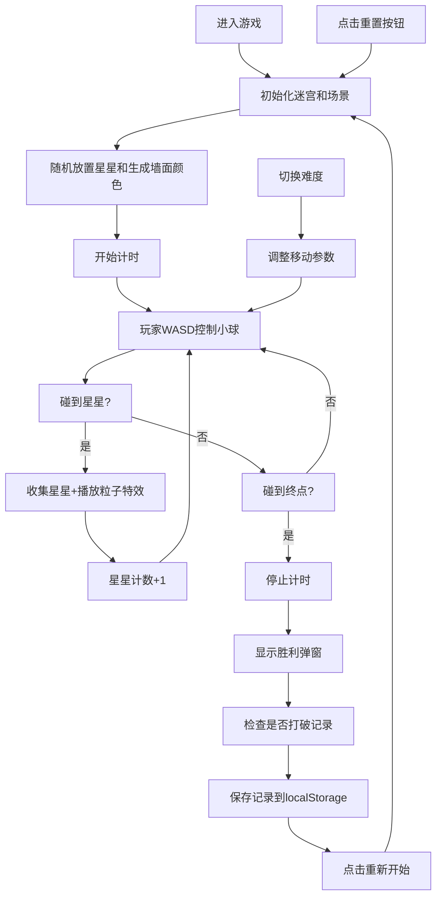

## 1. 产品概述

3D迷宫探险游戏是一款基于Three.js的休闲网页游戏，玩家控制小球在15x15的迷宫中探索，收集星星并到达终点。游戏具有物理惯性、碰撞检测、粒子特效等丰富的交互体验。

- 主要目的：提供轻松有趣的3D迷宫探险体验，考验玩家的方向感和操作技巧
- 目标用户：休闲游戏玩家、Three.js技术爱好者

## 2. 核心功能

### 2.1 用户角色
| 角色 | 注册方式 | 核心权限 |
|------|----------|----------|
| 玩家 | 无需注册 | 进行游戏、调整设置、查看记录 |

### 2.2 功能模块
1. **游戏主界面**：3D迷宫场景、玩家小球、星星、终点
2. **控制系统**：WASD键盘控制、物理惯性、碰撞检测
3. **UI界面**：计时器、星星计数、小地图、难度选择、音乐开关、重置按钮
4. **胜利系统**：胜利弹窗、用时统计、记录保存、破纪录提示
5. **设置系统**：难度选择（简单/困难）、背景音乐开关、墙面随机颜色

### 2.3 页面详情
| 页面名称 | 模块名称 | 功能描述 |
|---------|----------|----------|
| 游戏主界面 | 3D场景渲染 | 15x15迷宫网格、墙壁和通道方块、俯视跟随相机 |
| 游戏主界面 | 玩家控制 | WASD控制小球移动、物理惯性模拟、墙壁碰撞检测 |
| 游戏主界面 | 收集系统 | 三个随机星星、收集粒子特效、星星计数显示 |
| 游戏主界面 | 终点系统 | 旋转金色方块、胜利检测、用时统计 |
| UI层 | 信息面板 | 实时计时器、星星收集数量显示 |
| UI层 | 小地图 | 迷宫全局缩略图、红点标记玩家位置 |
| UI层 | 控制面板 | 难度选择、音乐开关、重置按钮 |
| UI层 | 胜利弹窗 | 显示用时、收集星数、最快记录、破纪录提示 |

## 3. 核心流程

## 4. 用户界面设计

### 4.1 设计风格
- 主色调：深邃的暗蓝色背景配合明亮的彩色墙壁
- 辅色调：金色（星星、终点）、红色（小地图标记）
- 按钮风格：圆角半透明玻璃质感，悬停有发光效果
- 字体：现代无衬线字体，清晰易读
- 整体风格：科幻感、简洁现代、沉浸式3D体验

### 4.2 页面设计概述
| 页面名称 | 模块名称 | UI元素 |
|---------|----------|--------|
| 游戏主界面 | 3D场景 | 15x15方块迷宫、发光墙壁、地面网格、柔和环境光 |
| 游戏主界面 | 玩家小球 | 带高光的金属质感球体、滚动时的动态阴影 |
| UI层 | 顶部信息栏 | 左侧计时器（mm:ss.ms）、右侧星星计数（图标+数字） |
| UI层 | 右上角小地图 | 120x120像素缩略图、白色墙壁、深色通道、红色玩家点 |
| UI层 | 底部控制栏 | 难度选择下拉框、音乐开关按钮、重置按钮 |
| UI层 | 胜利弹窗 | 半透明黑色遮罩、居中白色卡片、祝贺标题、统计数据、重新开始按钮 |

### 4.3 响应性
- 桌面端优先设计，自适应窗口大小
- Canvas占满整个视口
- UI元素使用固定定位，确保在各种屏幕尺寸下布局合理
- 小地图在小屏幕上适当缩小

### 4.4 3D场景指导
- **环境**：深色调背景，营造沉浸式空间感
- **光照**：环境光 + 方向光 + 玩家小球点光源，产生柔和阴影
- **相机**：俯视跟随视角，位置在小球正上方稍后方，平滑跟随
- **交互**：小球滚动时的旋转动画、星星浮动动画、终点旋转动画
- **粒子特效**：收集星星时的金色粒子爆发效果
- **性能优化**：使用InstancedMesh渲染墙壁，保持60fps帧率
