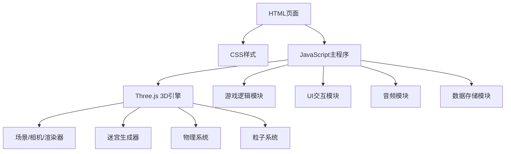

## 1. 架构设计



## 2. 技术描述

- **前端**：原生 HTML5 + CSS3 + JavaScript (ES6+)
- **3D引擎**：Three.js r150+ (通过CDN引入)
- **构建工具**：无需构建，纯静态页面
- **部署**：可直接部署到任何静态文件服务器

**技术选型理由**：
- 纯原生实现，无需复杂的构建工具链，易于理解和维护
- Three.js提供强大的WebGL渲染能力，支持复杂3D场景
- 使用CDN引入Three.js，减少项目体积
- localStorage本地存储，无需后端服务

## 3. 文件结构

| 文件 | 用途 |
|------|------|
| `index.html` | 主HTML页面，包含游戏容器和UI元素 |
| `css/style.css` | 样式文件，定义UI外观和布局 |
| `js/game.js` | 主游戏逻辑，包含所有游戏核心代码 |

## 4. 核心模块设计

### 4.1 迷宫生成模块
- **算法**：深度优先搜索(DFS)生成随机迷宫
- **数据结构**：15x15二维数组，0表示通道，1表示墙壁
- **生成规则**：
  - 起点固定在(1, 1)
  - 终点固定在(13, 13)
  - 确保起点到终点有通路
  - 星星放置在随机通道位置

### 4.2 物理系统
- **位置更新**：基于速度和加速度的欧拉积分
- **惯性模拟**：速度衰减系数，模拟摩擦力
- **碰撞检测**：
  - AABB包围盒检测墙壁碰撞
  - 碰撞响应：将小球从墙壁中推出
  - 半径：小球半径0.4，墙壁单元格大小1.0

### 4.3 相机系统
- **模式**：俯视跟随视角
- **位置**：小球正上方8单位，后方2单位
- **朝向**：始终看向小球位置
- **平滑**：使用线性插值(Lerp)实现平滑跟随

### 4.4 粒子系统
- **触发时机**：收集星星时触发
- **粒子数量**：20-30个金色粒子
- **运动**：随机方向向外扩散，带重力效果
- **生命周期**：1秒后自动消失

## 5. 数据存储

### 5.1 localStorage键值定义
| 键名 | 类型 | 说明 |
|------|------|------|
| `maze_best_time` | number | 最快通关时间（秒） |
| `maze_music_enabled` | boolean | 背景音乐开关状态 |
| `maze_difficulty` | string | 难度设置（easy/hard） |

### 5.2 游戏状态
```javascript
{
  startTime: number,      // 游戏开始时间戳
  elapsedTime: number,    // 已用时间（秒）
  starsCollected: number, // 已收集星星数
  totalStars: number,     // 总星星数（固定3）
  isPlaying: boolean,     // 游戏是否进行中
  isWon: boolean,         // 是否胜利
  playerPos: {x, z},      // 玩家网格坐标
  difficulty: 'easy'|'hard' // 难度
}
```

## 6. 难度参数配置

| 参数 | 简单模式 | 困难模式 |
|------|---------|---------|
| 移动加速度 | 15 | 25 |
| 最大速度 | 5 | 10 |
| 摩擦系数 | 0.92 | 0.96 |
| 操作手感 | 容易控制 | 惯性大，需要技巧 |
