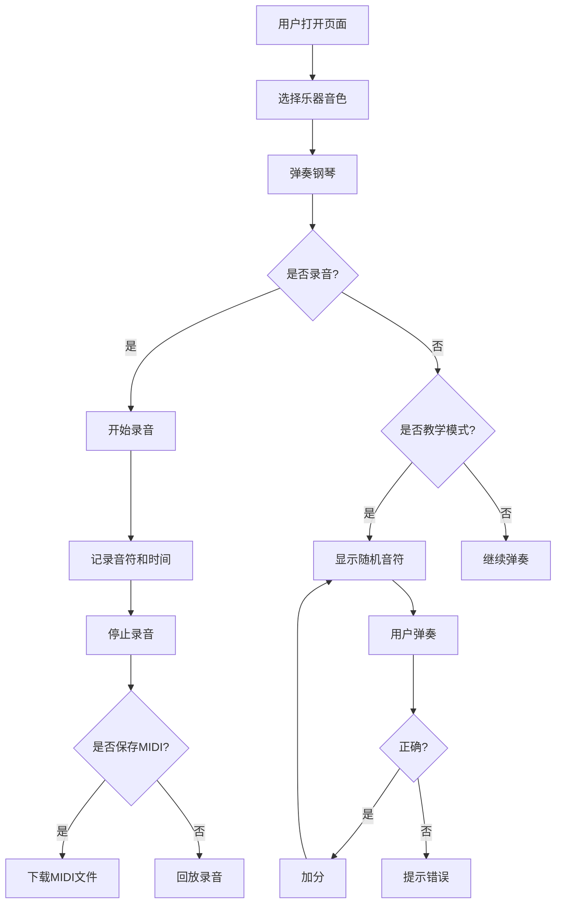

## 1. 产品概述
虚拟钢琴模拟器是一个基于Web的音乐应用，用户可以通过鼠标或电脑键盘弹奏钢琴，支持录音、MIDI文件导入导出、多种乐器音色切换等功能。
- 主要目的：提供一个免费、易用的在线钢琴学习和演奏工具
- 目标用户：音乐爱好者、钢琴初学者、音乐教育工作者
- 市场价值：无需下载安装，随时随地练习和创作音乐

## 2. 核心功能

### 2.1 用户角色
| 角色 | 注册方式 | 核心权限 |
|------|----------|----------|
| 普通用户 | 无需注册 | 使用所有功能，包括弹奏、录音、MIDI导入导出 |

### 2.2 功能模块
1. **钢琴键盘**：两个八度的完整钢琴键盘，包含白键和黑键
2. **演奏控制**：鼠标点击、键盘按键、多音符同时发声
3. **录音系统**：录制弹奏的音符和时间间隔，支持回放
4. **MIDI功能**：保存录音为MIDI文件，加载并播放MIDI文件
5. **乐器切换**：钢琴、电子琴、风琴、吉他四种音色
6. **节拍器**：可调BPM的滴答声辅助练习
7. **延音踏板**：模拟钢琴踏板效果
8. **教学模式**：音符识别练习，计分系统
9. **示范曲**：内置简单旋律，一键播放
10. **音量控制**：音量调节滑块

### 2.3 页面详情
| 页面名称 | 模块名称 | 功能描述 |
|----------|----------|----------|
| 主页面 | 钢琴键盘区 | 两个八度琴键，点击/按键发声，按下高亮显示 |
| 主页面 | 控制面板区 | 录音/回放按钮、MIDI导入导出、乐器选择、节拍器设置 |
| 主页面 | 教学模式区 | 音符显示、计时器、分数显示、开始/停止按钮 |
| 主页面 | 状态栏 | 当前音符显示、音量滑块、延音踏板按钮 |

## 3. 核心流程

### 3.1 弹奏流程
用户打开页面 → 选择乐器音色 → 通过鼠标点击或键盘按键弹奏 → 琴键高亮并发声 → 状态栏显示当前音符

### 3.2 录音流程
点击录音按钮 → 开始录制（记录音符和时间）→ 弹奏钢琴 → 点击停止 → 点击回放播放录音 → 可选保存为MIDI文件

### 3.3 教学模式流程
点击开始教学 → 随机显示音符名称 → 用户在限定时间内按下正确琴键 → 计分并进入下一题

## 4. 用户界面设计

### 4.1 设计风格
- 主色调：深紫色渐变背景（#1a0a2e 到 #2d1b4e），营造音乐舞台氛围
- 辅助色：金色（#ffd700）用于高亮和重点元素
- 琴键颜色：纯白色白键、纯黑色黑键，按下时金色发光效果
- 按钮风格：圆角玻璃拟态按钮，半透明背景，悬停时有光泽效果
- 字体：标题使用 'Playfair Display' 衬线字体，正文使用 'Inter' 无衬线字体
- 布局：居中布局，钢琴键盘为视觉中心，控制面板位于上下两侧
- 图标：使用简洁的线性图标，配合微动画效果

### 4.2 页面设计概览
| 页面名称 | 模块名称 | UI元素 |
|----------|----------|--------|
| 主页面 | 钢琴键盘区 | 渐变背景、发光琴键、按下动画、音符标签 |
| 主页面 | 控制面板区 | 玻璃拟态按钮组、下拉选择器、滑块控件 |
| 主页面 | 教学模式区 | 大号音符显示、倒计时圆环、分数面板 |
| 主页面 | 状态栏 | 当前音符气泡、音量滑块、踏板状态指示 |

### 4.3 响应式设计
- 桌面端优先设计，钢琴键盘完整显示
- 平板端：缩小琴键尺寸，调整控制面板布局
- 移动端：横向滚动钢琴键盘，简化控制界面
- 触摸优化：增大触摸区域，支持多指触控

### 4.4 动效设计
- 琴键按下：快速缩放+金色发光，释放时弹性回弹
- 音符播放：琴键上方飞出彩色音符粒子
- 录音状态：红色呼吸灯效果
- 页面加载：琴键从下往上依次显现的交错动画
- 按钮悬停：微妙的上浮和光晕效果
