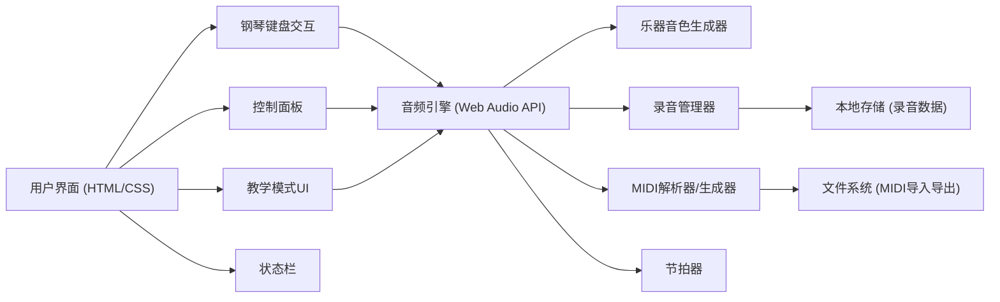

## 1. 架构设计



## 2. 技术描述

- **前端**：纯 HTML5 + CSS3 + 原生 JavaScript (ES6+)
- **音频技术**：Web Audio API 用于音频合成和播放
- **MIDI 处理**：使用 jsmidgen 库生成 MIDI 文件，midi-player-js 解析 MIDI
- **无后端**：纯前端应用，所有功能在浏览器端实现
- **数据存储**：LocalStorage 保存用户设置和录音记录

## 3. 文件结构

| 文件路径 | 用途 |
|----------|------|
| `/index.html` | 主页面 HTML 结构 |
| `/css/style.css` | 样式文件，包含钢琴键盘和控制面板样式 |
| `/js/audioEngine.js` | 音频引擎，Web Audio API 封装 |
| `/js/piano.js` | 钢琴键盘逻辑和交互 |
| `/js/recorder.js` | 录音和回放管理 |
| `/js/midiHandler.js` | MIDI 文件导入导出 |
| `/js/metronome.js` | 节拍器功能 |
| `/js/teachingMode.js` | 教学模式逻辑 |
| `/js/demoSongs.js` | 内置示范曲数据 |
| `/js/app.js` | 应用主入口，事件绑定和初始化 |
| `/lib/` | 第三方库目录 (jsmidgen, midi-player-js) |

## 4. 核心模块设计

### 4.1 音频引擎模块
```javascript
// AudioEngine 类
class AudioEngine {
  constructor() {}
  init() {} // 初始化 AudioContext
  playNote(note, frequency, duration, instrument) {} // 播放音符
  stopNote(note) {} // 停止音符
  setVolume(volume) {} // 设置音量
  setSustain(enabled) {} // 延音踏板
}
```

### 4.2 钢琴键盘模块
```javascript
// Piano 类
class Piano {
  constructor(audioEngine) {}
  createKeyboard() {} // 创建钢琴键盘DOM
  keyDown(note) {} // 琴键按下
  keyUp(note) {} // 琴键释放
  highlightKey(note) {} // 高亮琴键
  clearHighlight() {} // 清除高亮
}
```

### 4.3 录音模块
```javascript
// Recorder 类
class Recorder {
  constructor(piano, audioEngine) {}
  startRecording() {} // 开始录音
  stopRecording() {} // 停止录音
  playRecording() {} // 回放录音
  getRecordData() {} // 获取录音数据
  setRecordData(data) {} // 设置录音数据
}
```

### 4.4 MIDI 处理模块
```javascript
// MidiHandler 类
class MidiHandler {
  constructor(recorder, piano) {}
  exportToMidi(recordingData) {} // 导出MIDI文件
  importFromMidi(file) {} // 导入MIDI文件
  playMidi(midiData) {} // 播放MIDI
}
```

### 4.5 教学模式模块
```javascript
// TeachingMode 类
class TeachingMode {
  constructor(piano) {}
  start() {} // 开始教学
  stop() {} // 停止教学
  generateQuestion() {} // 生成问题
  checkAnswer(note) {} // 检查答案
  nextQuestion() {} // 下一题
}
```

## 5. 琴键映射表

### 白键 (电脑键盘 -> 钢琴音符)
| A | S | D | F | G | H | J | K |
|---|---|---|---|---|---|---|---|
| C4 | D4 | E4 | F4 | G4 | A4 | B4 | C5 |

### 黑键 (电脑键盘 -> 钢琴音符)
| W | E | T | Y | U | O | P |
|---|---|---|---|---|---|---|
| C#4 | D#4 | F#4 | G#4 | A#4 | C#5 | D#5 |

## 6. 乐器音色参数

| 乐器 | 波形类型 | 包络 (ADSR) | 效果器 |
|------|----------|-------------|--------|
| 钢琴 | 混合正弦+三角波 | 快速攻击，快速衰减 | 轻微混响 |
| 电子琴 | 方波 | 中等攻击，中等释放 | 合唱效果 |
| 风琴 | 锯齿波 | 慢速攻击，慢速释放 | 旋转扬声器模拟 |
| 吉他 | 脉冲波 | 快速攻击，指数衰减 | 轻微失真 |

## 7. 性能优化
- 使用 Web Audio API 进行高效音频处理
- 琴键元素使用 CSS transform 实现动画，避免重排
- 录音数据采用增量存储，避免内存溢出
- MIDI 解析使用流式处理，支持大文件
