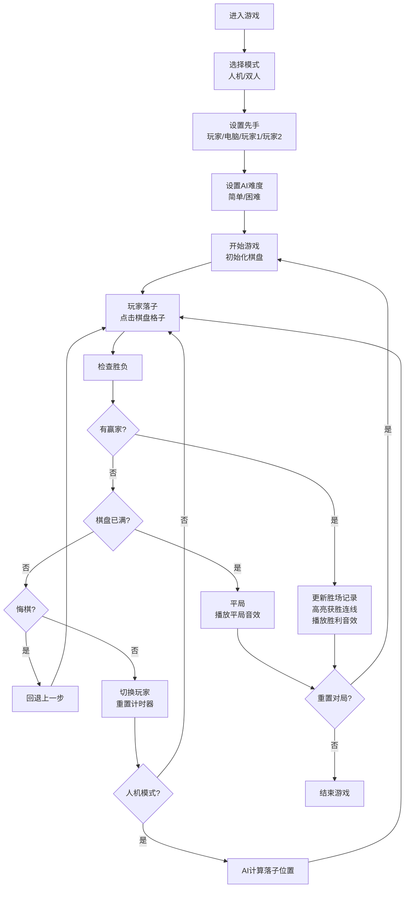

## 1. 产品概述
4x4井字棋强化版游戏，基于HTML、CSS和原生JavaScript开发。相较于传统3x3井字棋，4x4棋盘需要连成4个棋子获胜，更具策略性和挑战性。支持人机对战和双人对战模式，提供丰富的游戏功能和个性化设置。

- **主要用途**：休闲益智游戏，锻炼逻辑思维能力
- **目标用户**：喜欢策略棋类游戏的各年龄段玩家
- **市场价值**：在传统井字棋基础上创新，提供更丰富的游戏体验

## 2. 核心功能

### 2.1 用户角色
| 角色 | 注册方式 | 核心权限 |
|------|----------|----------|
| 玩家 | 无需注册 | 进行游戏、调整设置、查看胜场记录 |

### 2.2 功能模块
1. **游戏主界面**：4x4棋盘、当前玩家指示、计时器、胜场统计
2. **游戏控制**：模式选择、难度选择、先手切换、悔棋、重置对局
3. **个性化设置**：主题切换（经典/暗黑/木质）、音效开关
4. **数据存储**：胜场记录localStorage持久化

### 2.3 页面详情
| 页面名称 | 模块名称 | 功能描述 |
|---------|----------|----------|
| 游戏主页面 | 棋盘区域 | 4x4网格棋盘，点击落子，支持触摸操作，胜利时高亮获胜连线 |
| 游戏主页面 | 信息面板 | 显示当前回合、剩余时间、双方胜场数 |
| 游戏主页面 | 控制面板 | 模式切换（人机/双人）、AI难度、先手选择、悔棋、重置 |
| 游戏主页面 | 设置面板 | 主题切换、音效开关 |

## 3. 核心流程

### 3.1 游戏流程
玩家进入游戏后，选择游戏模式（人机对战或双人对战），设置先手方和AI难度，然后开始游戏。双方轮流在棋盘上落子，每步限时30秒。先将4个棋子连成一线（横、竖、对角线）的玩家获胜。若棋盘填满仍无玩家获胜，则为平局。胜场数自动保存到本地存储。

### 3.2 Mermaid流程图

## 4. 用户界面设计

### 4.1 设计风格
- **主色调**：根据主题动态变化
  - 经典主题：清爽蓝白配色，蓝色(#2563eb)为主色调
  - 暗黑主题：深色背景，霓虹青(#06b6d4)为主色调
  - 木质主题：暖棕色(#92400e)木纹背景
- **按钮风格**：圆角矩形，带悬停和点击动效，阴影层次分明
- **字体**：使用Google Fonts的'Orbitron'作为标题字体（科技感），'Noto Sans SC'作为正文字体
- **布局风格**：卡片式布局，居中对齐，响应式设计
- **图标风格**：使用Emoji和CSS绘制的几何图形，简洁明了

### 4.2 页面设计概述
| 页面名称 | 模块名称 | UI元素 |
|---------|----------|--------|
| 游戏主页面 | 棋盘区域 | 4x4网格，格子带边框和悬停效果，落子动画，胜利高亮 |
| 游戏主页面 | 信息面板 | 计时器环形进度条，玩家标识，胜场数字滚动效果 |
| 游戏主页面 | 控制面板 | 标签页式模式切换，滑块式难度选择，按钮组 |
| 游戏主页面 | 设置面板 | 主题预览卡片，开关按钮 |

### 4.3 响应式设计
- **设计原则**：桌面优先，移动端自适应
- **桌面端**：棋盘尺寸480x480px，侧边栏布局控制面板
- **平板端**：棋盘尺寸400x400px，控制面板调整为底部布局
- **移动端**：棋盘尺寸90vw x 90vw，控制面板堆叠布局，优化触摸目标尺寸（最小44x44px）
- **触摸优化**：支持touchstart事件，增加点击反馈，防止误触

## 5. 非功能性需求
- **性能要求**：AI计算响应时间<500ms，动画帧率60fps
- **兼容性**：支持Chrome、Firefox、Safari、Edge等主流浏览器最新版本
- **可访问性**：键盘导航支持，语义化HTML，颜色对比度符合WCAG AA标准
