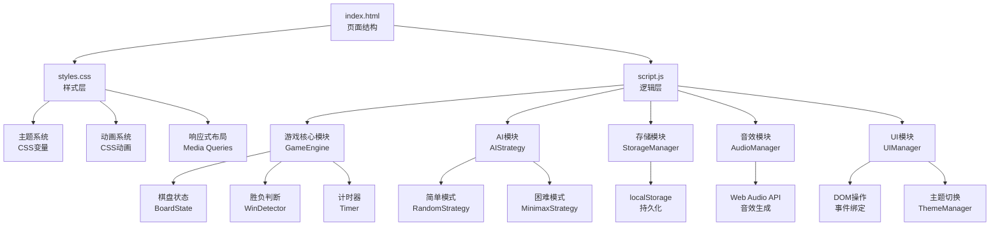

## 1. 架构设计

本项目为纯前端应用，无需后端服务。使用原生HTML、CSS和JavaScript实现，遵循模块化设计原则。



## 2. 技术描述

### 2.1 技术栈
- **前端**：HTML5 + CSS3 + JavaScript (ES2020)
- **构建工具**：无需构建工具，原生运行
- **第三方依赖**：Google Fonts（字体），无其他外部依赖

### 2.2 核心技术选型理由
- **原生JavaScript**：项目规模适中，无需框架 overhead，性能最优
- **CSS变量**：实现主题切换的最佳实践，无需JavaScript操作样式
- **Web Audio API**：动态生成音效，无需音频文件，减少资源加载
- **localStorage**：轻量级本地存储，适合保存游戏设置和胜场记录
- **Minimax算法**：4x4棋盘搜索空间可控，alpha-beta剪枝优化性能

## 3. 文件结构

```
/Users/mac/code/solo coder/99/
├── index.html              # 主页面结构
├── styles.css              # 样式文件（含主题变量）
├── script.js               # 主逻辑文件
└── .trae/
    └── documents/
        ├── prd.md          # 产品需求文档
        └── tech-arch.md    # 技术架构文档（本文件）
```

### 3.1 文件职责说明

| 文件名 | 职责 | 核心内容 |
|--------|------|----------|
| index.html | 页面结构 | 语义化HTML，棋盘网格，控制面板，设置面板 |
| styles.css | 样式呈现 | CSS变量主题系统，响应式布局，动画效果，交互反馈 |
| script.js | 业务逻辑 | 游戏引擎，AI算法，状态管理，事件处理，数据持久化 |

## 4. 核心数据结构

### 4.1 棋盘状态
```javascript
// 4x4棋盘，使用一维数组表示，0=空，1=玩家X，2=玩家O
const board = [
    0, 0, 0, 0,
    0, 0, 0, 0,
    0, 0, 0, 0,
    0, 0, 0, 0
];

// 历史记录（用于悔棋）
const history = [
    { board: [...], currentPlayer: 1, move: { row: 0, col: 0 } }
];
```

### 4.2 游戏状态
```javascript
const gameState = {
    board: Array<number>,      // 棋盘状态
    currentPlayer: 1 | 2,      // 当前玩家
    gameMode: 'pvp' | 'pve',   // 游戏模式
    difficulty: 'easy' | 'hard', // AI难度
    firstPlayer: 1 | 2,        // 先手玩家
    isGameOver: boolean,       // 游戏是否结束
    winner: null | 1 | 2 | 'draw', // 胜利者
    winningLine: Array<number>,    // 获胜连线坐标
    timeLeft: number,          // 当前玩家剩余时间（秒）
    scores: {                  // 胜场记录
        player1: number,
        player2: number,
        draws: number
    },
    settings: {
        theme: 'classic' | 'dark' | 'wood', // 主题
        soundEnabled: boolean, // 音效开关
        timeLimit: number      // 每步时限（秒）
    }
};
```

### 4.3 获胜线检测
4x4棋盘共有10条可能的获胜线：
- 横向：4条（每行1条）
- 纵向：4条（每列1条）
- 对角线：2条（两条主对角线）

## 5. 核心算法

### 5.1 胜负检测算法
```javascript
function checkWin(board, player) {
    const lines = [
        // 横向
        [0, 1, 2, 3], [4, 5, 6, 7], [8, 9, 10, 11], [12, 13, 14, 15],
        // 纵向
        [0, 4, 8, 12], [1, 5, 9, 13], [2, 6, 10, 14], [3, 7, 11, 15],
        // 对角线
        [0, 5, 10, 15], [3, 6, 9, 12]
    ];
    
    for (const line of lines) {
        if (line.every(index => board[index] === player)) {
            return line; // 返回获胜连线
        }
    }
    return null;
}
```

### 5.2 Minimax算法（带Alpha-Beta剪枝）
```javascript
function minimax(board, depth, isMaximizing, alpha, beta, aiPlayer) {
    const humanPlayer = aiPlayer === 1 ? 2 : 1;
    
    // 终止条件
    const aiWin = checkWin(board, aiPlayer);
    const humanWin = checkWin(board, humanPlayer);
    const isFull = board.every(cell => cell !== 0);
    
    if (aiWin) return 10 - depth;
    if (humanWin) return depth - 10;
    if (isFull) return 0;
    
    if (isMaximizing) {
        let maxEval = -Infinity;
        for (let i = 0; i < 16; i++) {
            if (board[i] === 0) {
                board[i] = aiPlayer;
                const eval = minimax(board, depth + 1, false, alpha, beta, aiPlayer);
                board[i] = 0;
                maxEval = Math.max(maxEval, eval);
                alpha = Math.max(alpha, eval);
                if (beta <= alpha) break;
            }
        }
        return maxEval;
    } else {
        let minEval = Infinity;
        for (let i = 0; i < 16; i++) {
            if (board[i] === 0) {
                board[i] = humanPlayer;
                const eval = minimax(board, depth + 1, true, alpha, beta, aiPlayer);
                board[i] = 0;
                minEval = Math.min(minEval, eval);
                beta = Math.min(beta, eval);
                if (beta <= alpha) break;
            }
        }
        return minEval;
    }
}
```

### 5.3 简单AI策略（防守优先）
```javascript
function getEasyAIMove(board, aiPlayer) {
    const humanPlayer = aiPlayer === 1 ? 2 : 1;
    const emptyCells = board.map((cell, i) => cell === 0 ? i : -1).filter(i => i !== -1);
    
    // 1. 检查是否能直接获胜
    for (const cell of emptyCells) {
        const testBoard = [...board];
        testBoard[cell] = aiPlayer;
        if (checkWin(testBoard, aiPlayer)) return cell;
    }
    
    // 2. 阻止玩家获胜
    for (const cell of emptyCells) {
        const testBoard = [...board];
        testBoard[cell] = humanPlayer;
        if (checkWin(testBoard, humanPlayer)) return cell;
    }
    
    // 3. 随机落子
    return emptyCells[Math.floor(Math.random() * emptyCells.length)];
}
```

## 6. 模块设计

### 6.1 GameEngine（游戏引擎）
- 管理游戏状态
- 处理落子逻辑
- 检测胜负和平局
- 管理回合切换
- 控制计时器

### 6.2 AIStrategy（AI策略）
- Easy模式：防守优先的随机策略
- Hard模式：Minimax算法 + Alpha-Beta剪枝

### 6.3 StorageManager（存储管理）
- 保存/加载胜场记录
- 保存/加载用户设置
- 使用localStorage持久化

### 6.4 AudioManager（音效管理）
- 使用Web Audio API动态生成音效
- 落子音效（不同频率区分玩家）
- 胜利音效（上升音阶）
- 平局音效（中性音调）
- 支持静音开关

### 6.5 UIManager（界面管理）
- 渲染棋盘和棋子
- 更新计时器显示
- 高亮获胜连线
- 处理用户交互事件
- 管理主题切换

## 7. 性能优化

### 7.1 AI优化
- Minimax搜索深度限制为6层，平衡性能和智能
- Alpha-Beta剪枝减少搜索节点
- 开局使用预定义策略，减少计算量

### 7.2 渲染优化
- 使用CSS transform和opacity实现动画，触发GPU加速
- 避免频繁重排重绘
- 使用requestAnimationFrame控制动画帧

### 7.3 存储优化
- 数据变更时防抖写入localStorage
- 仅存储必要数据，避免冗余
